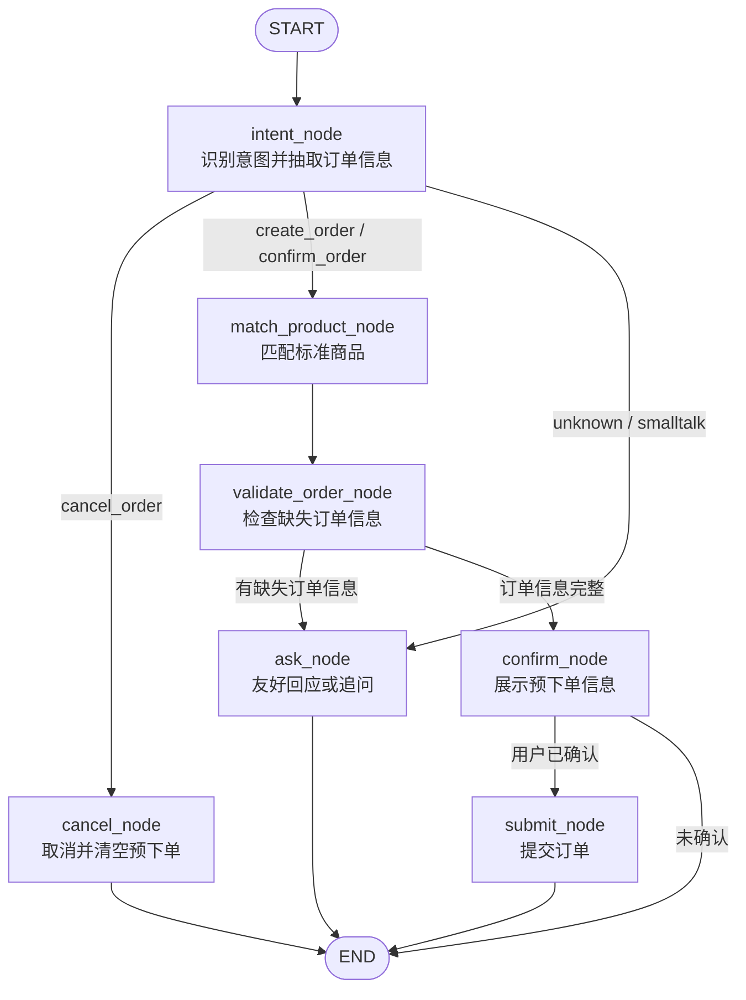

# Hotel AI Order Agent

这是一个面向酒店场景的 AI 语音下单 Agent。系统用于把用户的自然语言描述转换成结构化订单信息，并通过商品匹配能力找到可下单的标准商品，最终引导用户确认、取消或提交订单。

当前主要覆盖的业务类型：

- 单次安装
- 单次测量
- 单次维修服务
- 托管维修

项目核心技术栈：

- 后端：Python、FastAPI、LangGraph、LangChain
- 记忆：LangGraph SQLite checkpoint
- 商品匹配：Qwen text-embedding、NumPy cosine similarity、Excel SPU 数据
- 配置：`.env`、Pydantic Settings
- 观测：LangSmith、LangGraph Studio、本地 trace 日志
- 前端：Vue 3、Vite、UnoCSS
- 依赖管理：`uv`

## 业务目标

用户可以用自然语言或语音表达需求，例如：

```text
B栋 301 门锁打不开
888 房间马桶堵了
帮我装一下卫生间五金挂件
量一下 1208 房间窗帘尺寸
```

系统需要完成：

1. 识别用户意图：创建订单、确认订单、取消订单、闲聊或未知。
2. 抽取订单信息：房号、商品/设备、问题描述、区域、紧急程度。
3. 判断服务类型：单次安装、单次测量、单次维修服务、托管维修。
4. 匹配标准商品：从 `assets/spu.xlsx` 中找到最合适的商品编码和商品名称。
5. 追问缺失信息：一次只问一个最关键问题。
6. 展示预下单信息：让用户确认、修改或取消。
7. 提交订单：当前项目用本地模拟订单号，后续可替换为真实工单 API。

## 业务流程

主流程由 LangGraph 状态机驱动：



节点职责：

- `intent_node`：识别 `intent`，并抽取 `order_info`。
- `match_product_node`：调用 `match_product_tool` 匹配标准商品。
- `validate_order_node`：检查必填订单信息是否完整。
- `ask_node`：追问缺失信息，或处理闲聊/偏题。
- `confirm_node`：展示预下单信息，等待用户确认。
- `cancel_node`：取消当前订单并清空预下单状态。
- `submit_node`：提交订单并保存最近一次订单摘要。

## 核心命名约定

本项目已经统一为通用下单领域命名，避免把安装、测量、维修、托管维修都绑定到 `repair`。

核心状态字段在 `graph/state.py`：

| 字段 | 含义 |
| --- | --- |
| `intent` | 用户本轮意图，例如 `create_order`、`confirm_order`、`cancel_order`、`smalltalk`、`unknown` |
| `service_type` | 业务服务类型，例如 `单次安装`、`单次测量`、`单次维修服务`、`托管维修` |
| `status` | 订单生命周期，例如 `idle`、`collecting`、`confirming`、`submitted`、`cancelled` |
| `order_info` | 从用户输入中抽取出的订单信息 |
| `missing_info` | 仍需追问的订单信息字段 |
| `matched_product` | 匹配到的标准商品 |
| `product_candidates` | 商品候选列表 |
| `product_match_status` | 商品匹配状态：`skipped`、`success`、`no_match`、`error` |
| `product_match_query` | 本轮用于商品匹配的查询文本 |
| `last_order` | 最近一次已提交订单 |
| `off_topic_count` | 用户偏离当前下单任务的次数 |

重要约定：

- 不再使用 `repair_order`、`current_order_type`、`extracted_fields`、`missing_fields`、`slots`、`order_kind` 等旧字段。
- `order_info` 是订单信息，不要再混用对话系统里的 `slots` 命名。
- `service_type` 使用真实业务值，不使用 `install`、`measure`、`repair` 这类内部枚举。
- Excel 中的字段名如 `service_product_code`、`service_product_name`、`service_order_type` 是原始数据列名，可以保留。

## 技术架构

```text
前端 Vue 页面
    |
    | POST /api/chat
    v
FastAPI API 层
    |
    v
LangGraph 订单状态机
    |
    |-- LLM：意图识别、订单信息抽取、追问、偏题回应
    |-- ProductMatcher：Qwen embedding 商品匹配
    |-- Tools：商品查询、订单创建、包内检查等工具
    |
    v
SQLite Checkpoint
```

主要模块：

| 路径 | 说明 |
| --- | --- |
| `app/main.py` | FastAPI 应用入口 |
| `api/routes.py` | `/api/chat`、历史查询、清空会话接口 |
| `graph/state.py` | LangGraph `AgentState` 定义 |
| `graph/builder.py` | LangGraph 节点、路由、运行入口 |
| `graph/agent_runtime.py` | 基于 `create_agent` 的辅助 Agent 和 middleware |
| `graph/studio.py` | LangGraph Studio 入口 |
| `prompts/` | 文件化 Prompt |
| `rag/product_matcher.py` | 商品 embedding 匹配核心逻辑 |
| `rag/qwen_embedding.py` | Qwen text-embedding 客户端 |
| `rag/spu_loader.py` | Excel SPU 数据加载和服务类型归一化 |
| `tools/product_match.py` | `match_product_tool` |
| `tools/maintenance.py` | 下单相关业务工具 |
| `config/settings.py` | 项目配置入口 |
| `frontend/` | Vue 3 前端页面 |
| `docs/` | 设计、测试、追踪、商品匹配文档 |

## LangGraph 状态机原理

系统不是每轮都从零开始，而是依靠 LangGraph checkpoint 维护会话状态。

每次用户发消息时：

1. FastAPI 接收 `message` 和 `session_id`。
2. `run_agent()` 把用户输入追加到 `messages`。
3. LangGraph 从 SQLite checkpoint 恢复该 `session_id` 的历史状态。
4. 图从 `intent_node` 开始运行。
5. 节点通过返回字典更新 `AgentState`。
6. `messages` 使用 `add_messages` 追加，而不是覆盖。
7. 最后一条 AI 消息作为 `answer` 返回给前端。
8. `order_preview` 从最新状态中生成，用于前端预下单卡片。

当前没有使用 `interrupt()` 做普通用户确认。原因是这是聊天式应用，用户每轮输入本身就是一次新的图调用；确认、取消、修改都应该作为状态机事件处理。

## Agent Middleware

主下单流程仍然由手写 LangGraph 状态机控制，保证订单生命周期可预测。项目另外通过 `graph/agent_runtime.py` 接入 LangChain 官方 `create_agent()`，用于处理无活跃订单时的闲聊、未知问题和简单工具问答。

当前接入的 middleware 包括：

- `log_model_call`：记录 LLM 调用前后和异常。
- `log_tool_call`：记录 Tool 调用前后和异常。
- `ModelRetryMiddleware` / `ToolRetryMiddleware`：给模型和工具调用增加轻量重试。
- `ModelCallLimitMiddleware` / `ToolCallLimitMiddleware`：限制单次辅助 Agent 的模型和工具调用次数，避免循环调用。

路由规则是：`intent_node` 识别为 `smalltalk` 或 `unknown`，且当前没有活跃订单时，进入 `assist_node`；如果正在收集或确认订单，则仍进入 `ask_node`，友好回应后把用户拉回下单主线。

## 商品匹配原理

商品数据来自 `assets/spu.xlsx`，关键字段包括：

- `服务商品编码`
- `服务商品名称`
- `所属服务类型`
- `商品类型`
- `关联品类`
- `关联区域`
- `关联故障现象`
- `备注`

匹配流程：

1. `SpuExcelLoader` 读取 Excel，过滤下架商品。
2. `ProductMatcher` 为每个商品生成两组向量：
   - `name`：基于服务商品名称。
   - `fault`：基于关联故障现象。
3. 使用 Qwen `text-embedding-v4` 生成 embedding。
4. 使用 NumPy 计算 cosine similarity。
5. 融合分数：

```text
final_score = name_score * PRODUCT_NAME_WEIGHT
            + fault_score * PRODUCT_FAULT_WEIGHT
            + service_type_adjustment
```

6. 如果用户输入中能识别服务类型，例如安装、测量、维修、托管，会对匹配服务类型的商品加分。
7. 返回 `best_match` 和 `candidates`。

向量会缓存在：

```text
data/embedding_cache/
```

当 Excel 文件、embedding 模型或文本构建版本变化时，会自动重建缓存。

## API 使用

### 发起对话

```bash
curl -X POST http://localhost:8000/api/chat \
  -H "Content-Type: application/json" \
  -d '{"message":"B栋 301 门锁打不开"}'
```

响应示例：

```json
{
  "session_id": "4f4c1d66-xxxx",
  "conversation_id": "4f4c1d66-xxxx",
  "answer": "请确认订单信息：...",
  "order_preview": {
    "service_type": "单次维修服务",
    "status": "confirming",
    "order_info": {
      "room_number": "B栋 301",
      "product": "门锁",
      "fault": "打不开",
      "area": "卫生间",
      "urgency": "medium"
    },
    "matched_product": {
      "service_product_code": "FWSP01468",
      "service_product_name": "钥匙柜（小修）",
      "service_order_type": "单次维修服务"
    },
    "product_candidates": [],
    "product_match_status": "success",
    "product_match_query": "门锁 打不开 卫生间",
    "missing_info": []
  }
}
```

### 多轮对话

后续请求带上同一个 `session_id`：

```bash
curl -X POST http://localhost:8000/api/chat \
  -H "Content-Type: application/json" \
  -d '{"session_id":"4f4c1d66-xxxx","message":"确认"}'
```

### 查看历史

```bash
curl http://localhost:8000/api/chat/{session_id}/history
```

### 清空会话

```bash
curl -X DELETE http://localhost:8000/api/chat/{session_id}
```

## 本地运行

### 1. 安装依赖

```bash
uv sync
```

### 2. 准备配置

```bash
cp .env.example .env
```

至少需要配置：

```env
OPENAI_API_KEY=你的模型 API Key
OPENAI_BASE_URL=你的 OpenAI 兼容接口地址
OPENAI_MODEL=qwen3.5-plus

QWEN_EMBEDDING_API_KEY=你的 Qwen embedding API Key
```

如果本地不需要 PostgreSQL，保持：

```env
POSTGRES_ENABLED=false
```

### 3. 启动后端

```bash
uv run uvicorn app.main:app --host 0.0.0.0 --port 8000 --reload
```

### 4. 启动前端

```bash
cd frontend
npm install
npm run dev
```

### 5. Docker 启动

```bash
docker compose up --build
```

## LangGraph Studio

项目已配置 LangGraph Studio：

```bash
uv run langgraph dev
```

Studio 中选择：

```text
order_graph
```

Studio 输入的是 LangGraph State，不是 FastAPI 请求体。示例：

```json
{
  "conversation_id": "studio-1208",
  "messages": [
    {
      "role": "user",
      "content": "1208房间空调不制冷，比较急"
    }
  ],
  "retry_count": 0,
  "off_topic_count": 0,
  "conversation_summary": "",
  "last_user_message": "1208房间空调不制冷，比较急"
}
```

Studio 适合看节点跳转、conditional edge 和 State 变化。LangSmith Trace 更适合看 Prompt、Token、Error 和模型输入输出。

## LangSmith 追踪

`.env` 中开启：

```env
LANGSMITH_TRACING=true
LANGSMITH_API_KEY=你的 LangSmith Key
LANGSMITH_PROJECT=hotel-ai-order-agent
```

项目会在 graph run 中写入：

- `run_name`: `order_graph`
- tags: `hotel-ai-order`、`order`、当前 `APP_ENV`
- metadata: `session_id`、`app_env`

## 配置说明

常用配置：

| 变量 | 说明 |
| --- | --- |
| `OPENAI_API_KEY` | 主 LLM API Key |
| `OPENAI_BASE_URL` | OpenAI 兼容接口地址 |
| `OPENAI_MODEL` | 主 LLM 模型名 |
| `LANGSMITH_TRACING` | 是否开启 LangSmith |
| `SQLITE_MEMORY_PATH` | LangGraph checkpoint SQLite 路径 |
| `POSTGRES_ENABLED` | 是否启用 PostgreSQL 日志 |
| `SPU_EXCEL_PATH` | SPU Excel 路径 |
| `QWEN_EMBEDDING_API_KEY` | Qwen embedding API Key |
| `QWEN_EMBEDDING_BATCH_SIZE` | Qwen embedding 批量大小，最大建议 10 |
| `PRODUCT_MATCH_THRESHOLD` | 商品匹配阈值 |
| `PRODUCT_NAME_WEIGHT` | 商品名称向量权重 |
| `PRODUCT_FAULT_WEIGHT` | 故障现象向量权重 |
| `SERVICE_TYPE_MATCH_BONUS` | 服务类型匹配加分 |
| `SERVICE_TYPE_MISMATCH_PENALTY` | 服务类型不匹配扣分 |

注意：项目通过 `load_dotenv(".env", override=True)` 让 `.env` 优先于系统环境变量。

## 前端说明

前端位于 `frontend/`，核心页面是 `frontend/src/App.vue`。

功能包括：

- 聊天消息区
- 语音输入按钮
- 示例快捷输入
- 预下单卡片
- 订单信息完整度
- 匹配商品展示
- 历史会话列表

前端会调用 `/api/chat`，并用响应中的 `order_preview` 更新预下单卡片。

## 目录结构

```text
.
├── api/                         # FastAPI 路由
├── app/                         # FastAPI 应用入口
├── assets/                      # SPU Excel 等业务数据
├── config/                      # 配置、数据库、日志
├── docs/                        # 设计文档、测试用例、追踪说明
├── frontend/                    # Vue 3 前端
├── graph/                       # LangGraph 状态、节点和 Studio 入口
├── memory/                      # PostgreSQL 日志与旧 memory 模块
├── prompts/                     # 文件化 Prompt
├── rag/                         # Qwen embedding 和商品匹配
├── schemas/                     # API 请求/响应模型
├── tests/                       # 测试数据
├── tools/                       # LangChain Tool 和工具协议
├── .env.example                 # 环境变量示例
├── docker-compose.yml
├── langgraph.json               # LangGraph Studio 配置
├── pyproject.toml
└── uv.lock
```

## 给 AI IDE 的上下文

后续 AI IDE 修改本项目时，请优先遵守以下约定：

1. 这是酒店 AI 下单 Agent，不是单纯维修 Agent。
2. 主状态字段使用 `intent`、`service_type`、`status`、`order_info`、`missing_info`。
3. 不要重新引入旧字段：`repair_order`、`current_order_type`、`extracted_fields`、`missing_fields`、`slots`、`order_kind`。
4. 普通用户确认/取消不要使用 LangGraph `interrupt()`，应通过 `intent` 和路由进入 `submit_node` 或 `cancel_node`。
5. Prompt 必须文件化，优先修改 `prompts/`，不要把大段 Prompt 写死在 Python 里。
6. 商品匹配相关代码使用 `ProductMatcher`、`match_product_tool`、`product_match_*` 命名。
7. Excel 原始字段 `service_product_code`、`service_product_name`、`service_order_type` 是业务数据列名，可以保留。
8. 修改状态字段时，需要同步更新：
   - `graph/state.py`
   - `graph/builder.py`
   - `prompts/`
   - `frontend/src/App.vue`
   - `docs/`
9. 修改前端接口字段时，要同步后端 `order_preview`。
10. 提交前建议运行：

```bash
uv run python -m compileall graph api schemas tools rag config
cd frontend && npm run build
```

## 常见问题

### 为什么不用 `interrupt()` 做用户确认？

这是聊天式应用。用户每一轮输入都会重新调用 `/api/chat`，LangGraph checkpoint 会恢复状态。确认、取消、修改都是普通对话事件，用状态机路由处理更稳定。

### 为什么 `.langgraph_api/` 被忽略？

`.langgraph_api/` 是 LangGraph Studio 本地运行缓存，包含 `.pckl` 状态文件，不应提交。

### 为什么保留 PostgreSQL、Redis、Qdrant 配置？

当前主流程主要依赖 LangGraph SQLite checkpoint。PostgreSQL 用于可选日志，Redis 和 Qdrant 是预留扩展位置，方便后续接入缓存或向量数据库。

## 相关文档

- `docs/workflow.md`：LangGraph 流程图。
- `docs/embedding_recall.md`：商品 embedding 匹配说明。
- `docs/langsmith_tracing.md`：LangSmith 追踪说明。
- `docs/sqlite_memory.md`：SQLite checkpoint 记忆说明。
- `docs/order_test_cases.md`：业务测试用例。
