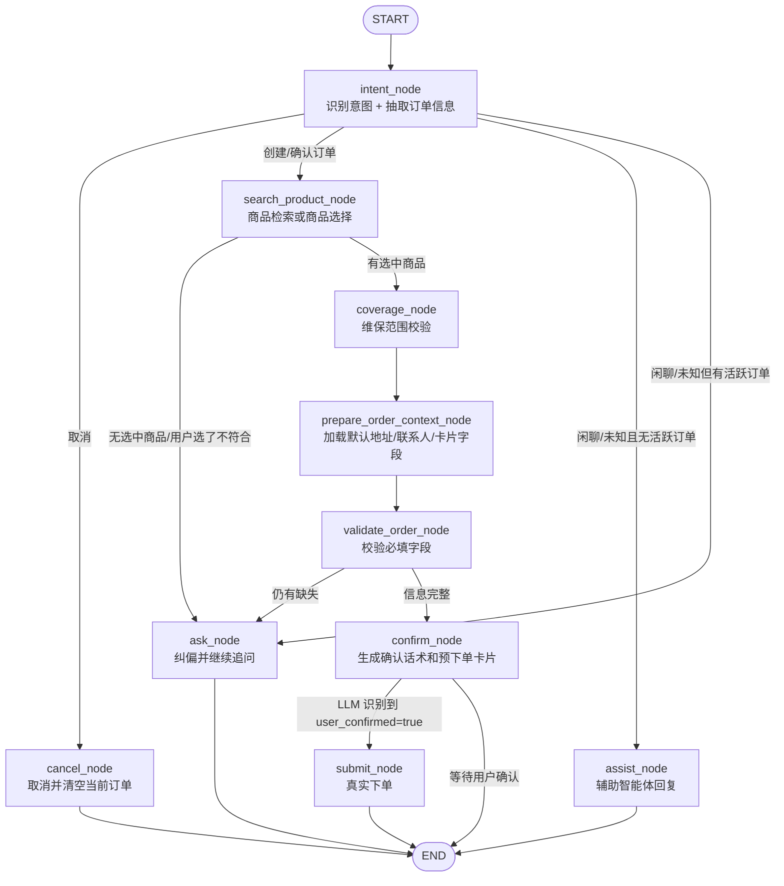

# Hotel AI Order Agent

这是一个面向酒店场景的 AI 语音下单 Agent。系统用于把用户的自然语言描述转换成结构化订单信息，并通过商品匹配能力找到可下单的标准商品，最终引导用户确认、取消或提交订单。

当前主要覆盖的业务类型：

- 单次安装
- 单次测量
- 单次维修服务
- 托管维修

项目核心技术栈：

- 后端：Python、FastAPI、LangGraph、LangChain
- 记忆：LangGraph SQLite checkpoint
- 商品匹配：Qwen text-embedding、BM25（jieba）+ 向量混合检索、Excel SPU 数据
- 配置：`.env`、Pydantic Settings
- 观测：LangSmith、LangGraph Studio、本地 trace 日志
- 前端：Vue 3、Vite、UnoCSS
- 依赖管理：`uv`

## 业务目标

用户可以用自然语言或语音表达需求，例如：

```text
B栋 301 门锁打不开
888 房间马桶堵了
帮我装一下卫生间五金挂件
量一下 1208 房间窗帘尺寸
```

系统需要完成：

1. 识别用户意图：创建订单、确认订单、取消订单、闲聊或未知。
2. 抽取订单信息：房号、商品/设备、问题描述、区域、紧急程度。
3. 匹配标准商品：用 `商品名 + 故障现象` 向量检索 `assets/spu.xlsx` 中的商品，匹配结果同时确定服务类型。
4. 按服务类型校验必填字段，追问缺失信息：一次只问一个最关键问题。
5. 展示预下单信息：让用户确认、修改或取消。
6. 提交订单：按用户端 App 的下单结构构造真实请求参数，并在配置、登录态和必填字段满足时调用真实下单接口。

## 完整流程速览

可以把这个项目理解成四层：

```text
用户自然语言 / 语音
    ↓
Vue 前端：聊天、流式展示、商品选择、预下单卡片编辑
    ↓
FastAPI：对话接口、流式接口、商品选择接口、订单信息更新接口、确认提交接口
    ↓
LangGraph 状态机：意图识别、商品匹配、维保范围校验、字段校验、追问、确认、提交
    ↓
工具层：SPU 检索、维保卡/地址/用户信息读取、真实下单参数构造、真实下单接口调用
```

一轮典型下单会经历：

1. 用户输入："1208 房空调不制冷，明天上午来修"。
2. 前端调用 `/api/chat/stream`，后端返回 NDJSON 流式事件。
3. `intent_node` 用 LLM 识别意图并抽取 `order_info`。
4. `search_product_node` 用商品检索工具找 Top3 标准商品。
5. 用户在前端商品卡片点选某个商品，或默认等待选择。
6. `coverage_node` 对托管维修商品做维保范围校验；不覆盖时可能降级为单次维修。
7. `prepare_order_context_node` 读取默认地址、联系人、维保卡等下单上下文，生成预下单卡片字段。
8. `validate_order_node` 检查缺失字段；缺字段进入 `ask_node` 追问。
9. 信息完整后进入 `confirm_node`，前端展示预下单卡片。
10. 用户可编辑联系人、电话、时间等字段，前端调用 `PATCH /api/chat/{session_id}/order-info` 同步状态。
11. 用户点击"确认下单"，前端调用 `POST /api/chat/{session_id}/confirm`，后端绕过 LLM 直接提交。
12. `submit_node` 构造真实下单参数，调用真实接口；成功后保存 `last_order` 并清空当前活跃订单状态，避免后续对话继续显示旧卡片。

## 状态机与节点编排

主流程由 `graph/builder.py` 中的 LangGraph 状态机驱动。状态结构定义在 `graph/state.py`，每个节点返回一个字典来更新 `AgentState`。



节点职责：

| 节点 | 主要职责 | 关键输入/输出 |
| --- | --- | --- |
| `intent_node` | 调用结构化 LLM，识别 `intent` 并抽取 `order_info`。提交成功后的新订单只看最新用户输入，避免旧订单被重新抽取。 | 输入 `messages`、`last_order`、`status`；输出 `intent`、`order_info`、`status`、`last_user_message` |
| `search_product_node` | 根据 `product + fault + 用户原文` 生成检索 query，调用 `search_product_tool` 取 Top3；也处理用户输入"1/2/3/以上都不符合"。 | 输出 `products`、`selected_product_code`、`service_type`、`ui_phase` |
| `coverage_node` | 托管维修商品校验维保卡覆盖范围；非托管维修跳过；范围外时 `effective_service_type` 可降级为单次维修。 | 输出 `coverage_result`、`effective_service_type`、`order_submit_route` |
| `prepare_order_context_node` | 读取维保卡、用户资料、地址、全局配置等默认值，并由 `graph/order_fields.py` 生成前端卡片字段。 | 输出 `order_context`、`order_card_fields`、`ui_phase=pre_order` |
| `validate_order_node` | 按最终服务类型校验必填字段，合并卡片必填项，决定继续追问还是进入确认。 | 输出 `missing_info`、`status=collecting/confirming` |
| `ask_node` | 对缺失字段生成追问；处理商品不合适、偏题、重复追问等场景。 | 输出 AI 消息、`off_topic_count` |
| `assist_node` | 无活跃订单时，使用 `create_agent()` 辅助智能体处理闲聊或简单问题。 | 输出辅助回复 |
| `confirm_node` | 信息完整后生成确认提示；如果本轮已经明确 `user_confirmed=true`，路由会进入提交。 | 输出确认话术、`status=confirming` |
| `submit_node` | 调用 `graph/submission.py::submit_order_from_state`，构造真实参数并提交订单。成功后写入 `last_order` 并清空活跃订单状态。 | 输出 `real_order_payload`、`real_order_result`、`status=submitted` |
| `cancel_node` | 用户取消时清空当前订单相关状态。 | 输出 `status=cancelled`、空 `order_info/products` |

## 状态字段与生命周期

`AgentState` 是整个系统的"共享记忆"。LangGraph checkpoint 会按用户和会话保存它，所以多轮对话不是靠前端记忆，而是靠后端状态恢复。

常见生命周期：

```text
idle
  ↓ 用户开始下单
collecting
  ↓ 商品已选、字段补齐
confirming
  ↓ 确认并真实提交成功
submitted

任意 collecting/confirming 阶段都可以取消：
collecting / confirming → cancelled
```

两个字段容易混淆：

- `status`：订单业务生命周期，控制能否确认、取消、提交。
- `ui_phase`：前端展示阶段，控制展示商品选择卡、预下单卡、提交成功卡。

关键状态字段：

| 字段 | 含义 |
| --- | --- |
| `messages` | LangGraph 消息历史，使用 `add_messages` 追加 |
| `user_id` | 当前会话所属用户，用于越权校验 |
| `intent` | 本轮意图：`create_order`、`confirm_order`、`cancel_order`、`smalltalk`、`unknown` |
| `order_info` | LLM 抽取和前端卡片编辑后合并的订单信息 |
| `products` | 商品检索结果 Top3 |
| `selected_product_code` | 当前选中的标准商品编码；未选中时为空 |
| `service_type` | 商品原始服务类型，例如 `托管维修`、`单次维修服务` |
| `effective_service_type` | 最终用于字段校验和提交的服务类型，托管维修范围外可能降级 |
| `coverage_result` | 维保范围校验结果 |
| `order_context` | 从用户端接口得到的地址、联系人、维保卡、配置等默认值 |
| `order_card_fields` | 后端生成、前端直接渲染的预下单卡片字段 |
| `missing_info` | 还需要用户补充的字段 |
| `real_order_payload` | 构造出的真实下单请求参数 |
| `real_order_result` | 真实下单接口返回 |
| `last_order` | 最近一次成功提交的订单摘要 |

## AI 对话与确定性操作

项目里有两类动作：

1. **需要 AI 理解的动作**：自然语言下单、补充字段、偏题纠偏、闲聊。这些通过 `/api/chat/stream` 或 `/api/chat` 进入 LangGraph，由 `intent_node`、`ask_node`、`assist_node` 使用 LLM。
2. **不需要 AI 猜测的动作**：点选商品、编辑卡片字段、点击确认按钮。这些由专门接口直接更新 checkpoint 状态，避免把 UI 操作再交给 LLM 重新解释。

这样设计的原因是：LLM 擅长理解自然语言，但点击按钮这类操作已经是明确意图，应该走确定性接口，减少误判。

具体接口：

| 前端动作 | 接口 | 后端函数 | 是否经过 LLM |
| --- | --- | --- | --- |
| 发送自然语言消息 | `POST /api/chat/stream` | `stream_agent_events()` | 是 |
| 非流式发送消息 | `POST /api/chat` | `run_agent()` | 是 |
| 点选商品卡片 | `POST /api/chat/{session_id}/select-product` | `select_product_in_session()` | 否 |
| 编辑预下单字段 | `PATCH /api/chat/{session_id}/order-info` | `update_order_info_in_session()` | 否 |
| 点击确认下单 | `POST /api/chat/{session_id}/confirm` | `confirm_order_in_session()` | 否 |
| 查看历史和当前卡片 | `GET /api/chat/{session_id}/history` | `get_checkpoint_messages()` / `get_checkpoint_state()` | 否 |
| 清空会话 | `DELETE /api/chat/{session_id}` | `clear_checkpoint_session()` | 否 |

## 流式事件协议

`POST /api/chat/stream` 返回 NDJSON，每一行都是一个 JSON 事件。前端逐行解析，边处理边更新 UI。

事件类型：

| 类型 | 用途 |
| --- | --- |
| `session` | 返回或确认本次 `session_id` |
| `status` | 更新"正在理解需求/正在匹配商品/正在提交订单"等进度文案 |
| `preview` | 返回最新 `order_preview`，前端据此刷新商品卡或预下单卡 |
| `token` | 打字机式追加 AI 回复内容 |
| `final` | 本轮完成，包含最终 `answer` 和最终 `order_preview` |
| `error` | 后端处理失败 |

前端解析流时要注意：

- NDJSON 可能一段里包含多行，也可能半行，需要用 buffer 拼接。
- 单行 JSON 解析失败不能让整个页面崩溃，应抛出可展示错误或跳过异常行。
- 如果流式接口失败，当前前端会 fallback 到非流式 `/api/chat`。

## 核心命名约定

本项目已经统一为通用下单领域命名，避免把安装、测量、维修、托管维修都绑定到 `repair`。

核心状态字段在 `graph/state.py`：

| 字段 | 含义 |
| --- | --- |
| `intent` | 用户本轮意图，例如 `create_order`、`confirm_order`、`cancel_order`、`smalltalk`、`unknown` |
| `service_type` | 业务服务类型，例如 `单次安装`、`单次测量`、`单次维修服务`、`托管维修` |
| `status` | 订单生命周期，例如 `idle`、`collecting`、`confirming`、`submitted`、`cancelled` |
| `order_info` | 从用户输入中抽取出的订单信息 |
| `missing_info` | 仍需追问的订单信息字段 |
| `products` | 商品检索结果（按相似度排序） |
| `selected_product_code` | 当前选中的商品编码；未指定时默认 Top1 |
| `last_order` | 最近一次已提交订单 |
| `off_topic_count` | 用户偏离当前下单任务的次数 |

详细 API 响应字段见 [docs/api_order_preview.md](docs/api_order_preview.md)。

重要约定：

- 不再使用 `repair_order`、`current_order_type`、`extracted_fields`、`missing_fields`、`slots`、`order_kind` 等旧字段。
- `order_info` 是订单信息，不要再混用对话系统里的 `slots` 命名。
- `service_type` 使用真实业务值，不使用 `install`、`measure`、`repair` 这类内部枚举。
- Excel 中的字段名如 `service_product_code`、`service_product_name`、`service_order_type` 是原始数据列名，可以保留。

## 技术架构

```text
前端 Vue 页面
    |
    | POST /api/chat/stream（优先）或 POST /api/chat（fallback）
    v
FastAPI API 层
    |
    v
LangGraph 订单状态机
    |
    |-- LLM：意图识别、订单信息抽取、追问、偏题回应
    |-- ProductVectorStore：Chroma 向量库商品匹配
    |-- Tools：商品查询、订单创建等工具
    |
    v
SQLite Checkpoint
```

主要模块：

| 路径 | 说明 |
| --- | --- |
| `app/main.py` | FastAPI 应用入口 |
| `api/routes.py` | `/api/chat`、历史查询、清空会话接口 |
| `graph/state.py` | LangGraph `AgentState` 定义 |
| `graph/builder.py` | LangGraph 节点、路由、运行入口 |
| `graph/order_fields.py` | 必填字段、预下单卡片字段、前端编辑字段归一化 |
| `graph/submission.py` | 订单提交和提交成功后的状态清理 |
| `graph/agent.py` | 基于 `create_agent` 的辅助 Agent |
| `graph/middleware.py` | 辅助 Agent 的模型/工具日志、重试、调用次数限制 |
| `graph/studio.py` | LangGraph Studio 入口 |
| `prompts/` | 文件化 Prompt |
| `rag/product_store.py` | Chroma 向量库封装，商品检索主路径 |
| `rag/qwen_embedding.py` | Qwen text-embedding 客户端 |
| `rag/spu_loader.py` | Excel SPU 数据加载和服务类型归一化 |
| `tools/product_search.py` | `search_product_tool`：向量检索商品，对话节点与 HTTP 接口的统一入口 |
| `tools/hosting_coverage.py` | 托管维修维保范围校验 |
| `tools/order_submit.py` | 真实下单入口和外部 App/API 调用封装 |
| `tools/order_submit_managed.py` | 托管维修下单参数构造 |
| `tools/order_submit_single.py` | 单次维修/安装/测量下单参数构造 |
| `config/settings.py` | 项目配置入口 |
| `frontend/` | Vue 3 前端页面 |
| `docs/` | 设计、测试、追踪、商品匹配文档 |

## LangGraph 状态机原理

系统不是每轮都从零开始，而是依靠 LangGraph checkpoint 维护会话状态。

每次用户发消息时：

1. FastAPI 接收 `message` 和 `session_id`。
2. `run_agent()` 把用户输入追加到 `messages`。
3. LangGraph 从 SQLite checkpoint 恢复该 `session_id` 的历史状态。
4. 图从 `intent_node` 开始运行。
5. 节点通过返回字典更新 `AgentState`。
6. `messages` 使用 `add_messages` 追加，而不是覆盖。
7. 最后一条 AI 消息作为 `answer` 返回给前端。
8. `order_preview` 从最新状态中生成，用于前端预下单卡片。

当前没有使用 `interrupt()` 做普通用户确认。原因是这是聊天式应用，用户每轮输入本身就是一次新的图调用；确认、取消、修改都应该作为状态机事件处理。

## Agent Middleware

主下单流程仍然由手写 LangGraph 状态机控制，保证订单生命周期可预测。项目另外通过 `graph/agent.py` 接入 LangChain 官方 `create_agent()`，并通过 `graph/middleware.py` 增加日志、重试和调用次数限制，用于处理无活跃订单时的闲聊、未知问题和简单工具问答。

当前接入的 middleware 包括：

- `log_model_call`：记录 LLM 调用前后和异常。
- `log_tool_call`：记录 Tool 调用前后和异常。
- `ModelRetryMiddleware` / `ToolRetryMiddleware`：给模型和工具调用增加轻量重试。
- `ModelCallLimitMiddleware` / `ToolCallLimitMiddleware`：限制单次辅助 Agent 的模型和工具调用次数，避免循环调用。

路由规则是：`intent_node` 识别为 `smalltalk` 或 `unknown`，且当前没有活跃订单时，进入 `assist_node`；如果正在收集或确认订单，则仍进入 `ask_node`，友好回应后把用户拉回下单主线。

## 流式交互设计

项目通过 `POST /api/chat/stream` 提供 NDJSON 流式响应，前端可以边处理边展示状态。后端使用 LangGraph 官方 `graph.astream(..., stream_mode=["updates", "messages", "custom"], version="v2")`。

流式事件分工：

- `updates`：节点完成后的状态更新，用于刷新预下单卡片。
- `messages`：LLM token 级输出，作为补充通道。
- `custom`：节点主动发出的用户可见事件，是当前主要流式通道。

建议实施策略：

1. `intent_node` 不直接流式展示结构化 JSON，而是通过 `custom` 持续输出进度，例如正在理解需求、正在识别意图、已识别服务类型。
2. `assist_node` 内部消费 `create_agent().astream(...)`，并把可展示文本通过 `custom token` 推给前端。
3. `ask_node` 内部消费 `get_llm().astream(...)`，把追问和偏题回复实时输出。
4. `confirm_node`、`submit_node`、`cancel_node` 是模板文本，不会产生 LLM token，因此通过 `custom token` 分块输出，保证正常下单流程也有打字机效果。
5. `intent_node`、结构化抽取、商品匹配等内部过程只输出状态，不把中间 JSON 或工具原始结果展示给用户。

## 商品匹配原理

商品数据来自 `assets/spu.xlsx`，关键字段包括：

- `服务商品编码`
- `服务商品名称`
- `所属服务类型`
- `商品类型`
- `关联区域`
- `关联故障现象`
- `备注`

**向量库构建**（`rag/product_store.py`）：

1. `SpuExcelLoader` 读取 Excel，过滤下架商品。
2. 每条商品生成索引文本：`服务商品名称 + 关联故障现象`。安装、测量类商品无故障现象，只用商品名。
3. 用 Qwen `text-embedding-v4` 将索引文本向量化，写入 Chroma 向量库（`data/chroma_db/`）。
4. 同时对商品名建立 BM25 倒排索引（in-memory，每次启动重建，用 jieba 搜索模式分词）。
5. 索引版本写入 `data/chroma_db/build_metadata.json`，版本或文件变化时向量库自动重建。

**检索**（`search_product_node`）：

1. 检索 query = `用户说的商品名 + 故障现象`。安装场景无故障现象，query 追加"安装"关键词；测量场景 query 退化为只有商品名。
2. **BM25 关键词过滤**：用商品名的 BM25 倒排索引（jieba 分词）圈定候选池，排除与 query 无任何关键词重叠的商品（如查"空调漏水"时水柜因名字里没有"空调"而被过滤）。
3. **向量排名**：Chroma 余弦相似度对过滤后的候选排序，过滤低分结果。
4. **故障惩罚**（`has_fault=True`）：用户描述了故障时，对无故障描述的商品（纯安装/测量类）扣 0.15 分，确保维修商品优于同名的安装商品（如"水龙头漏水"找维修而非安装）。
5. `products[0].service_order_type` 即为本次订单的 `service_type`，后续必填字段由此决定。

## 必填字段与追问逻辑

`validate_order_node` 根据 `service_type` 取必填清单，与已有 `order_info` 对比，得到 `missing_info`，触发 `ask_node` 追问。

| 订单类型 | 必填字段 | 备注 |
| --- | --- | --- |
| 托管维修（客房） | area、room_number、product、fault | 有房号时 managed_repair_scope 自动为客房 |
| 托管维修（公区） | area、product、fault | 检测到公区关键词时 room_number 自动置 `/` |
| 单次维修服务 | product、fault、expected_start_time | — |
| 单次安装 | product、expected_start_time、goods_arrival_status | goods_arrival_status：未到场 / 已到场 / 已到物流站 |
| 单次测量 | product、expected_start_time | — |

补充规则：

- **urgency**：不在必填清单，默认为 `medium`（普通），不主动追问。
- **expected_start_time**：支持自然语言（今天下午、明天上午、下周一、3月20日），无法理解时追问。
- **托管维修客房/公区判断**：有明确房号 → 客房；出现大堂、走廊、电梯厅等公区关键词 → 公区，`room_number` 自动置 `/`。

多轮对话下 `order_info` 增量合并，每轮用户补充一个字段即可推进流程：

```text
轮1: "帮我修空调"
  order_info = {product: "空调"}
  service_type = 单次维修服务（匹配商品决定）
  missing = [fault, expected_start_time]
  → 追问：请问是什么问题？

轮2: "不制冷"
  order_info = {product: "空调", fault: "不制冷"}
  missing = [expected_start_time]
  → 追问：请问什么时间方便上门？

轮3: "明天上午"
  order_info = {product: "空调", fault: "不制冷", expected_start_time: "明天上午"}
  missing = []
  → 展示确认信息，等待用户确认
```

## 真实下单链路

提交链路分三层：

```text
graph/submission.py
    ↓ 调用
tools/order_submit.py
    ↓ 按订单类型分发
tools/order_submit_managed.py / tools/order_submit_single.py
```

`tools/order_submit.py::submit_real_order()` 会根据 `effective_service_type` 路由：

| 最终服务类型 | 提交路由 | 说明 |
| --- | --- | --- |
| `托管维修` | `managed_repair` | 调用托管维修下单结构，依赖维保卡、区域树、故障现象等上下文 |
| `单次维修服务` | `single_repair` | 走单次订单结构 |
| `单次安装` | `single_install` | 走单次订单结构，并要求货物到场状态 |
| `单次测量` | `single_measure` | 走单次订单结构 |

重要规则：

- 联系人、电话优先使用前端卡片编辑后的 `order_info.contacts`、`order_info.phone`，再回退到 `order_context`。
- `submit_node` 提交成功后会调用 `clear_active_order_state()` 清空当前活跃订单相关字段，只保留 `last_order`。这是为了避免后续闲聊或新订单继续携带旧预下单卡片。
- 如果真实提交开关关闭、缺少必填参数、接口未返回订单号，状态会停留在 `confirming` 或 `collecting`，前端会展示失败原因和可重试按钮。
- 托管维修商品如果不在维保范围内，`coverage_node` 会把 `effective_service_type` 降级为 `单次维修服务`，后续字段校验和提交都按降级后的类型走。

## API 使用

所有需要用户身份的接口都会通过 `api/deps.py::get_current_user` 读取请求头，生成 `UserContext`。前端调试参数保存在本地，发请求时由 `buildApiHeaders()` 写入 header。

### 流式发起对话

```bash
curl -N -X POST http://localhost:8000/api/chat/stream \
  -H "Content-Type: application/json" \
  -d '{"session_id":"demo-session","message":"1208 房空调不制冷，明天上午来修"}'
```

响应是 NDJSON，示意：

```json
{"type":"session","session_id":"demo-session"}
{"type":"status","step":"intent_node","message":"正在理解您的需求并提取订单信息..."}
{"type":"preview","step":"search_product_node","order_preview":{"ui_phase":"product_selection"}}
{"type":"token","step":"confirm_node","content":"好的，收到。"}
{"type":"final","session_id":"demo-session","answer":"好的，收到。信息已齐全...","order_preview":{"status":"confirming"}}
```

### 非流式发起对话

```bash
curl -X POST http://localhost:8000/api/chat \
  -H "Content-Type: application/json" \
  -d '{"session_id":"demo-session","message":"B栋 301 门锁打不开"}'
```

响应结构：

```json
{
  "session_id": "demo-session",
  "answer": "请确认订单信息...",
  "order_preview": {
    "ui_phase": "pre_order",
    "status": "confirming",
    "service_type": "托管维修",
    "effective_service_type": "托管维修",
    "order_info": {
      "room_number": "B栋 301",
      "product": "门锁",
      "fault": "打不开"
    },
    "products": {
      "status": "success",
      "query": "门锁 打不开",
      "selected_code": "FWSP01468",
      "items": [
        {
          "code": "FWSP01468",
          "name": "钥匙柜（小修）",
          "service_type": "单次维修服务",
          "rank": 1,
          "is_recommended": true,
          "is_selected": true
        }
      ]
    },
    "order_card": {
      "fields": []
    },
    "coverage": {
      "checked": true,
      "covered": true,
      "reason": "该商品在维保范围内"
    },
    "missing_info": [],
    "submission": {
      "payload": {},
      "result": {},
      "missing_fields": []
    }
  }
}
```

字段说明见 [docs/api_order_preview.md](docs/api_order_preview.md)。

### 多轮对话继续补字段

后续请求带上同一个 `session_id`：

```bash
curl -X POST http://localhost:8000/api/chat \
  -H "Content-Type: application/json" \
  -d '{"session_id":"demo-session","message":"明天上午"}'
```

### 选择商品（前端点选卡片）

```bash
curl -X POST http://localhost:8000/api/chat/demo-session/select-product \
  -H "Content-Type: application/json" \
  -d '{"product_code":"FWSP01537"}'
```

### 编辑预下单卡片字段

```bash
curl -X PATCH http://localhost:8000/api/chat/demo-session/order-info \
  -H "Content-Type: application/json" \
  -d '{"updates":{"phone":"13900001111","contacts":"张三"}}'
```

### 确认下单（按钮）

```bash
curl -X POST http://localhost:8000/api/chat/demo-session/confirm \
  -H "Content-Type: application/json"
```

这个接口不会再让 LLM 判断"确认"是什么意思，而是直接读取 checkpoint 中的当前预下单状态，重新校验必填字段，然后提交。

### 查看历史和当前卡片

```bash
curl http://localhost:8000/api/chat/demo-session/history
```

### 清空会话

```bash
curl -X DELETE http://localhost:8000/api/chat/demo-session
```

## 本地运行

### 1. 安装依赖

```bash
uv sync
```

### 2. 准备配置

```bash
cp .env.example .env
```

至少需要配置：

```env
OPENAI_API_KEY=你的模型 API Key
OPENAI_BASE_URL=你的 OpenAI 兼容接口地址
OPENAI_MODEL=qwen3.5-plus

QWEN_EMBEDDING_API_KEY=你的 Qwen embedding API Key
```

如果本地不需要 PostgreSQL，保持：

```env
POSTGRES_ENABLED=false
```

### 3. 启动后端

```bash
uv run uvicorn app.main:app --host 0.0.0.0 --port 8000 --reload
```

### 4. 启动前端

```bash
cd frontend
npm install
npm run dev
```

### 5. Docker 启动

```bash
docker compose up --build
```

## LangGraph Studio

项目已配置 LangGraph Studio：

```bash
uv run langgraph dev
```

Studio 中选择：

```text
order_graph
```

Studio 输入的是 LangGraph State，不是 FastAPI 请求体。示例：

```json
{
  "messages": [
    {
      "role": "user",
      "content": "1208房间空调不制冷，比较急"
    }
  ],
  "retry_count": 0,
  "off_topic_count": 0,
  "conversation_summary": "",
  "last_user_message": "1208房间空调不制冷，比较急"
}
```

Studio 适合看节点跳转、conditional edge 和 State 变化。LangSmith Trace 更适合看 Prompt、Token、Error 和模型输入输出。

## LangSmith 追踪

`.env` 中开启：

```env
LANGSMITH_TRACING=true
LANGSMITH_API_KEY=你的 LangSmith Key
LANGSMITH_PROJECT=hotel-ai-order-agent
```

项目会在 graph run 中写入：

- `run_name`: `order_graph`
- tags: `hotel-ai-order`、`order`、当前 `APP_ENV`
- metadata: `session_id`、`app_env`

## 配置说明

常用配置：

| 变量 | 说明 |
| --- | --- |
| `OPENAI_API_KEY` | 主 LLM API Key |
| `OPENAI_BASE_URL` | OpenAI 兼容接口地址 |
| `OPENAI_MODEL` | 主 LLM 模型名 |
| `LANGSMITH_TRACING` | 是否开启 LangSmith |
| `SQLITE_MEMORY_PATH` | LangGraph checkpoint SQLite 路径 |
| `POSTGRES_ENABLED` | 是否启用 PostgreSQL 日志 |
| `SPU_EXCEL_PATH` | SPU Excel 路径 |
| `QWEN_EMBEDDING_API_KEY` | Qwen embedding API Key |
| `QWEN_EMBEDDING_BATCH_SIZE` | Qwen embedding 批量大小，最大建议 10 |
| `PRODUCT_SEARCH_THRESHOLD` | 商品搜索相似度阈值（Chroma 向量检索用） |

注意：项目通过 `load_dotenv(".env", override=True)` 让 `.env` 优先于系统环境变量。

## 前端说明与注意事项

前端位于 `frontend/`，主页面是 `frontend/src/App.vue`。它负责状态编排和接口调用，展示组件已经拆分到：

| 路径 | 职责 |
| --- | --- |
| `frontend/src/App.vue` | 会话状态、流式请求、商品选择、字段更新、确认/取消等事件处理 |
| `frontend/src/types/order.ts` | 前端使用的 `OrderPreview`、商品、卡片字段等类型 |
| `frontend/src/components/ProductSelectionCard.vue` | 商品候选卡片和"以上都不符合"操作 |
| `frontend/src/components/OrderPreviewCard.vue` | 预下单字段展示、编辑、确认/取消按钮 |
| `frontend/src/components/OrderStatusNotices.vue` | 缺字段、维保范围、提交失败/提交中提示 |
| `frontend/src/utils/apiParams.ts` | 本地调试 header 参数加载、保存、重置 |

前端核心状态都从 `order_preview` 派生：

| 前端 computed | 来源 | 用途 |
| --- | --- | --- |
| `uiPhase` | `order_preview.ui_phase` | 判断展示商品选择还是预下单卡 |
| `previewStatus` | `order_preview.status` | 判断是否 collecting / confirming / submitted |
| `productItems` | `order_preview.products.items` | 渲染候选商品 |
| `selectedProductCode` | `order_preview.products.selected_code` | 判断当前选中商品 |
| `orderFields` | `order_preview.order_card.fields` | 渲染后端生成的预下单字段 |
| `missingInfoText` | `order_preview.missing_info` | 展示缺失字段 |
| `coverageNotice` | `order_preview.coverage` | 展示维保范围提示 |
| `submittedOrderId` | `order_preview.submission.result` | 展示真实单号 |

前端调用链：

1. 普通消息优先调用 `/api/chat/stream`。
2. 流式失败时 fallback 到 `/api/chat`。
3. 商品卡点击调用 `/api/chat/{session_id}/select-product`。
4. 卡片字段编辑调用 `/api/chat/{session_id}/order-info`。
5. 确认按钮调用 `/api/chat/{session_id}/confirm`。
6. 取消按钮仍发送"取消，不用了"，让状态机走 `cancel_node`。

前端注意事项：

- 不要在前端自己推断服务类型、必填字段或下单字段。前端只渲染后端 `order_preview`。
- 商品卡片必须使用后端返回的 `selected_code` 判断选中态，不要按数组下标保存选择。
- 卡片编辑后必须调用后端更新 checkpoint，否则真实提交会继续使用旧字段。
- 确认按钮不要再发送普通聊天消息，应该调用确定性 `/confirm` 接口。
- 提交成功后后端会清空活跃订单字段，前端如果看到 `status=submitted`，只展示成功状态和单号，不应继续展示可编辑预下单卡。
- `apiParams` 只是本地调试辅助，生产环境应由网关或登录态注入真实 header。

## 后端注意事项

- `service_type` 来自商品匹配结果，不应该由 LLM 直接决定。
- `effective_service_type` 才是字段校验和真实提交时使用的最终类型。
- 修改订单字段时，要同步 `graph/order_fields.py`、`schemas/order_preview.py`、`frontend/src/types/order.ts`。
- 修改状态字段时，要同步 `graph/state.py`、`build_order_preview_model()` 和前端 computed。
- `order_card_fields` 是前端卡片的契约，字段 `key` 一旦发布要谨慎修改。
- `submit_order_from_state()` 成功后必须清空 `products`、`selected_product_code`、`order_info`、`real_order_payload` 等活跃订单字段，否则后续对话会重新显示旧卡片。
- `last_order` 用来回答"刚才那个订单"这类追问，不等于当前活跃订单。
- 所有会话读取和更新前都要调用 `ensure_session_access()`，避免用户访问别人的 checkpoint。

## 目录结构

```text
.
├── api/                         # FastAPI 路由
├── app/                         # FastAPI 应用入口
├── assets/                      # SPU Excel 等业务数据
├── config/                      # 配置、数据库、日志
├── docs/                        # 设计文档、测试用例、追踪说明
├── frontend/                    # Vue 3 前端
├── graph/                       # LangGraph 状态、节点和 Studio 入口
├── memory/                      # PostgreSQL 日志与旧 memory 模块
├── prompts/                     # 文件化 Prompt（见 docs/prompts.md）
├── rag/                         # Qwen embedding 和商品匹配
├── schemas/                     # API 请求/响应模型
├── tests/                       # 集成测试（pytest + pytest-asyncio）
├── tools/                       # LangChain Tool 和工具协议
├── .env.example                 # 环境变量示例
├── docker-compose.yml
├── langgraph.json               # LangGraph Studio 配置
├── pyproject.toml
└── uv.lock
```

## 给 AI IDE 的上下文

后续 AI IDE 修改本项目时，请优先遵守以下约定：

1. 这是酒店 AI 下单 Agent，不是单纯维修 Agent。
2. 主状态字段使用 `intent`、`service_type`、`status`、`order_info`、`missing_info`。
3. 不要重新引入旧字段：`repair_order`、`current_order_type`、`extracted_fields`、`missing_fields`、`slots`、`order_kind`。
4. 普通用户确认/取消不要使用 LangGraph `interrupt()`，应通过 `intent` 和路由进入 `submit_node` 或 `cancel_node`。
5. Prompt 必须文件化，优先修改 `prompts/`，不要把大段 Prompt 写死在 Python 里。目录规则见 `docs/prompts.md`：**一个节点 → 一个同名子目录**（如 `intent_node` → `prompts/intent/`）。
6. 商品检索主路径是 `rag/product_store.py`（`ProductVectorStore` / Chroma）。工具层入口是 `tools/product_search.py::search_product_tool`，节点是 `search_product_node`，HTTP 接口 `/api/products/search` 也统一走这个工具；检索元数据（`status` / `query` / `feedback`）在 API 层由 `products` 推导，不再单独写入 state。
7. Excel 原始字段 `service_product_code`、`service_product_name`、`service_order_type` 是业务数据列名，可以保留。
8. 修改状态字段时，需要同步更新：
   - `graph/state.py`
   - `graph/builder.py`
   - `graph/order_fields.py`
   - `graph/submission.py`
   - `prompts/`
   - `schemas/order_preview.py`
   - `frontend/src/App.vue`
   - `frontend/src/types/order.ts`
   - `frontend/src/components/OrderPreviewCard.vue`
   - `frontend/src/components/ProductSelectionCard.vue`
   - `docs/`
9. 修改前端接口字段时，要同步后端 `order_preview`。
10. 点选商品、编辑卡片、确认提交是确定性接口，不要退回成普通聊天消息。
11. 提交前建议运行：

```bash
uv run pytest tests/test_order_submit_payload.py tests/test_search_product_node.py tests/test_order_preview.py tests/test_order_cases_fixture.py
cd frontend && npm run build
```

## 集成测试

项目测试分两类：

- 快速回归测试：主要验证订单预览、商品节点、真实下单 payload、fixture 覆盖等，不强依赖真实 LLM。
- 聊天集成测试：`tests/test_chat_flow.py` 覆盖端到端聊天流程，可能调用真实 LLM。

常用快速回归：

```bash
uv run pytest tests/test_order_submit_payload.py tests/test_search_product_node.py tests/test_order_preview.py tests/test_order_cases_fixture.py
```

如果想看到测试步骤、输入状态和输出 payload，可显式打开追踪：

```bash
uv run pytest --trace-flow tests/test_order_submit_payload.py::test_single_order_payload_uses_edited_contacts_and_phone

# 或
TRACE_TEST_STEPS=1 uv run pytest tests/test_product_selection_flow.py
```

聊天集成测试：

```bash
# 运行全部聊天流
uv run pytest tests/test_chat_flow.py -v

# 只跑某一组
uv run pytest tests/test_chat_flow.py -v -k "TestSingleTurn"
uv run pytest tests/test_chat_flow.py -v -k "TestMultiTurn"

# 单个用例
uv run pytest tests/test_chat_flow.py::TestSingleTurnComplete::test_guest_room_ac_repair -v
```

| 分组 | 用例数 | 覆盖场景 |
|------|--------|---------|
| `TestSingleTurnComplete` | 3 | 字段完整、公区识别 |
| `TestMissingField` | 3 | 缺房号 / 商品、模糊故障 |
| `TestMultiTurn` | 3 | 多轮补齐、纠正字段、公区接客房 |
| `TestCancelAndSmallTalk` | 2 | 取消、闲聊不下单 |
| `TestProductMatch` | 2 | service_type 来自商品匹配 |


### 为什么不用 `interrupt()` 做用户确认？

这是聊天式应用。用户每一轮输入都会重新调用 `/api/chat`，LangGraph checkpoint 会恢复状态。确认、取消、修改都是普通对话事件，用状态机路由处理更稳定。

### 为什么 `.langgraph_api/` 被忽略？

`.langgraph_api/` 是 LangGraph Studio 本地运行缓存，包含 `.pckl` 状态文件，不应提交。

### 为什么保留 PostgreSQL、Redis、Qdrant 配置？

当前主流程主要依赖 LangGraph SQLite checkpoint。PostgreSQL 用于可选日志，Redis 和 Qdrant 是预留扩展位置，方便后续接入缓存或向量数据库。

## 相关文档

- `docs/workflow.md`：LangGraph 流程图。
- `docs/embedding_recall.md`：商品 embedding 匹配说明。
- `docs/langsmith_tracing.md`：LangSmith 追踪说明。
- `docs/sqlite_memory.md`：SQLite checkpoint 记忆说明。
- `docs/order_test_cases.md`：业务测试用例。
