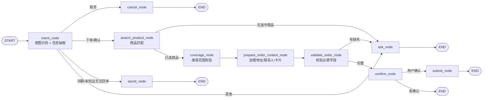

# Hotel AI Order Agent — 功能清单

> 最后更新：2026-06-12  
> 本文档梳理项目**已实现**、**部分实现**与**待实现**功能，便于评审、排期与对外沟通。

---

## 项目定位

酒店场景 **语音/文本 AI 下单 Agent**：把自然语言 → 结构化订单 → 匹配标准商品 → 多轮追问 → 确认 → 提交工单。

**核心技术栈：** Python、FastAPI、LangGraph、LangChain、Qwen Embedding、Chroma、Vue 3

**当前覆盖的业务类型：**

- 单次安装
- 单次测量
- 单次维修服务
- 托管维修

---

## 业务流程概览



---

## 一、已实现功能

### 1.1 核心业务对话流程（LangGraph 状态机）

主流程 **10 个节点**已全部打通：

| 节点 | 职责 |
| --- | --- |
| `intent_node` | 意图识别 + 订单信息抽取（结构化 JSON） |
| `search_product_node` | 商品向量检索 Top3，进入 `product_selection` 阶段 |
| `coverage_node` | 托管维修维保卡覆盖校验；范围外可降级为单次维修 |
| `prepare_order_context_node` | 读取默认地址、联系人、维保卡，生成预下单卡片字段 |
| `validate_order_node` | 按最终服务类型校验必填字段，计算 `missing_info` |
| `ask_node` | 追问缺失信息 / 偏题拉回主线 |
| `assist_node` | 无活跃订单时的闲聊与工具问答 |
| `confirm_node` | 展示预下单信息，等待确认 |
| `cancel_node` | 取消并清空预下单状态 |
| `submit_node` | 经 `workflow/submission.py` 提交订单，写入 `submitted_order` 并清空活跃单 |

**已实现的具体能力：**

| 能力 | 说明 |
| --- | --- |
| 意图识别 | `create_order` / `confirm_order` / `cancel_order` / `smalltalk` / `unknown` |
| 订单信息抽取 | 房号、商品、故障、区域、紧急度、期待开工时间、货物到场、托管范围等 |
| 四种服务类型 | 单次安装、单次测量、单次维修服务、托管维修（必填字段规则不同） |
| 商品选择阶段 | Top3 候选 + 前端卡片点选 / 对话「1/2/3」/「以上都不符合」 |
| 维保范围校验 | `coverage_node` + `effective_service_type` 降级 |
| 预下单卡片 | `order_context` + `order_card_fields` 驱动前端渲染与编辑 |
| 多轮收集 | `order_info` 增量合并，一次只追问一个 `missing_info` 字段 |
| 公区/客房判断 | 关键词 + 房号规则；公区自动 `room_number = /` |
| 期待开工时间 | 支持「明天上午」「3月20日」等自然语言（`workflow/expected_time.py`） |
| 确认/取消 | `phase`：`idle` → `collecting` → `product_selection` → `pre_order` → `submitted` / `cancelled` |
| 确定性提交 | 前端确认按钮走 `POST /confirm`，不经 LLM 重新识别 |
| 偏题处理 | 下单过程中闲聊走 `ask_node`；无活跃单时走 `assist_node` |
| 会话记忆 | LangGraph SQLite checkpoint，同一 `session_id` 多轮恢复 |

**各服务类型必填字段：**

| 订单类型 | 必填字段 | 备注 |
| --- | --- | --- |
| 托管维修（客房） | area、room_number、product、fault | 有房号时 scope 自动为客房 |
| 托管维修（公区） | area、product、fault | 公区关键词时 room_number 自动置 `/` |
| 单次维修服务 | product、fault、expected_start_time | — |
| 单次安装 | product、expected_start_time、goods_arrival_status | 未到场 / 已到场 / 已到物流站 |
| 单次测量 | product、expected_start_time | — |

---

### 1.2 商品匹配（RAG）

| 能力 | 实现位置 |
| --- | --- |
| Excel SPU 加载 | `repositories/spu_loader.py` + `assets/spu.xlsx` |
| Qwen embedding 向量化 | `repositories/qwen_embedding.py` |
| Chroma 向量库 | `repositories/product_store.py`，持久化到 `data/chroma_db/` |
| 关键词 + 向量混合检索 | jieba 分词过滤 + 余弦相似度排序 |
| 故障惩罚 | 用户有故障描述时，安装/测量类商品扣 0.15 分 |
| 自动重建索引 | Excel / 模型 / 版本变化时自动重建 |
| service_type 由商品决定 | 匹配结果的 `service_order_type` 写入状态 |
| 统一检索入口 | `tools/product_search.py` → 图节点 + HTTP 接口共用 |
| 离线召回评测集 | `tests/fixtures/product_recall_cases.json` + 可选 pytest |

检索流程：

```
query（商品 + 故障）
    ↓
关键词过滤（剔除无关键词重叠的商品）
    ↓
Chroma 向量排名
    ↓
has_fault 惩罚（安装/测量类扣分）
    ↓
用户选品 → selected_product_code → service_type
```

---

### 1.3 LLM / Prompt / 辅助 Agent

| 能力 | 说明 |
| --- | --- |
| 文件化 Prompt | `prompts/intent/`、`ask/`、`confirm/`、`submit/`、`cancel/`、`assist/` |
| 结构化意图输出 | `intent_node` 使用 `with_structured_output(IntentResult)` |
| 追问生成 | 大部分字段 LLM 生成；时间/货物到场用固定话术 |
| 辅助 Agent | `assist_node` + `create_agent()`，可调用工具 |
| Middleware | 日志、重试、模型/工具调用次数限制（`workflow/middleware.py`） |

**辅助 Agent 可用工具：**

| 工具 | 用途 |
| --- | --- |
| `current_time` | 查询当前时间 |
| `search_product_tool` | 商品库检索 |
| `web_search_tool` | Tavily 互联网搜索 |
| `check_package_tool` | 套餐检查 |
| `submit_real_order_tool` | 构造/提交下单参数（辅助 Agent 不直接提交） |
| `query_hosting_scope_tool` | 查询维保卡与维保商品范围 |

---

### 1.4 后端 API（FastAPI）

| 接口 | 功能 |
| --- | --- |
| `POST /api/chat` | 同步对话 |
| `POST /api/chat/stream` | NDJSON 流式（session / status / preview / token / final / error） |
| `POST /api/chat/{session_id}/select-product` | 前端点选商品（确定性，不经 LLM） |
| `PATCH /api/chat/{session_id}/order-info` | 前端编辑预下单字段（确定性） |
| `POST /api/chat/{session_id}/confirm` | 前端确认按钮提交（确定性） |
| `GET /api/chat/{session_id}/history` | 历史消息 + `order_preview` |
| `DELETE /api/chat/{session_id}` | 清空会话 checkpoint |
| `GET /api/products` | 商品列表（可按服务类型筛选） |
| `POST /api/products/search` | 商品向量检索调试接口 |
| `GET /health` | 健康检查 |

**鉴权：** 对话类接口需 `Authorization` + `X-User-Id` + `tenant-id`（见 `api/deps.py`）；会话越权校验已实现。

---

### 1.5 真实下单对接（四类服务）

`tools/order_submit.py` 作为统一入口，按 `effective_service_type` 分发：

| 服务类型 | 实现模块 | 接口 |
| --- | --- | --- |
| 托管维修 | `tools/order_submit_managed.py` | `POST /app-api/order/company-managed-repair-order/create` |
| 单次安装/测量/维修 | `tools/order_submit_single.py` | `POST /app-api/order/publish-order/create`（含 checkDouble） |

**已实现能力：**

1. admin-api / app-api 拉取 SPU、故障现象、区域、用户资料、维保卡等上下文
2. 托管与单次订单 payload 构造（`order_payload_managed.py` / `order_payload_single.py`）
3. 故障现象匹配、区域匹配、紧急标志、默认联系人/地址等
4. `USER_APP_SUBMIT_ENABLED=true` 且 token 配置完整时 **真正调用线上接口**
5. 未开启时仍生成 `request_payload` 预览

**相关配置（`.env`）：**

```env
USER_APP_SUBMIT_ENABLED=false          # 生产改为 true；代码默认以 .env 为准
USER_APP_ACCESS_TOKEN=...
USER_APP_TENANT_ID=...
ADMIN_API_BASE_URL=...
USER_APP_BASE_URL=...
MANAGED_REPAIR_HOTEL_NAME=...
USER_APP_DEFAULT_CONTACTS=...
USER_APP_DEFAULT_PHONE=...
USER_APP_DEFAULT_ADDRESS=...
# ... 其他默认地址字段
```

---

### 1.6 前端（Vue 3）

| 能力 | 说明 |
| --- | --- |
| 聊天界面 | Markdown 渲染、示例快捷输入 |
| 流式对话 | 默认走 `/api/chat/stream`，打字机效果 |
| 商品选择卡片 | `ProductSelectionCard.vue` + `/select-product` |
| 预下单卡片 | `OrderPreviewCard.vue`，字段由后端 `order_card.fields` 驱动，支持编辑 |
| 状态提示 | `OrderStatusNotices.vue`（缺字段、维保范围、提交中/失败） |
| 成功卡片 | `OrderSuccessCard.vue` |
| 浏览器语音输入 | Web Speech API（Chrome 系支持较好） |
| 会话历史 | localStorage + 后端 history 恢复 |
| 商品检索调试页 | `ProductTest.vue`（RAG 参数可调） |
| API 参数调试 | Header 注入（Authorization、tenant-id 等） |

---

### 1.7 工程化与观测

| 能力 | 说明 |
| --- | --- |
| 配置管理 | `.env` + Pydantic Settings |
| LangSmith 追踪 | 可配置 `LANGSMITH_TRACING` |
| LangGraph Studio | `uv run langgraph dev`，图名 `order_graph` |
| 本地 trace 日志 | `trace_event`（`DEBUG_TRACE_ENABLED`） |
| Docker Compose | app + Postgres + Redis + Qdrant |
| 快速回归测试 | payload、preview、选品流程、商品节点、fixture 校验等（无需 LLM） |
| 集成测试 | `tests/test_chat_flow.py` 约 13 个真实 LLM 场景（`@pytest.mark.llm`） |
| 商品召回评测 | `tests/fixtures/product_recall_cases.json`（`@pytest.mark.embedding`） |
| 业务用例文档 | `docs/order_test_cases.md` + `tests/fixtures/order_cases.json` |

**运行测试：**

```bash
# 默认快速回归（无 LLM / embedding）
uv run pytest tests/test_order_cases_fixture.py tests/test_order_submit_payload.py \
  tests/test_search_product_node.py tests/test_order_preview.py \
  tests/test_product_selection_flow.py tests/test_product_recall_keyword.py -v

# 集成测试（需配置 LLM Key）
uv run pytest tests/test_chat_flow.py -v -m llm

# 商品召回评测（需 Qwen embedding + chroma_db）
uv run pytest tests/test_product_recall_eval.py -v -m embedding
```

---

## 二、部分实现 / 半成品

> 有代码或设计，但未形成完整闭环，评审时需单独说明。

| 模块 | 现状 | 缺口 |
| --- | --- | --- |
| **真实下单** | 四类 create 接口与 payload 代码已具备 | **生产联调验证**、失败重试、字段覆盖仍需确认 |
| **下单开关** | 默认 `.env.example` 中 `USER_APP_SUBMIT_ENABLED=false` | 生产需配 token、默认地址、酒店名、区域 ID 等 |
| **订单修改** | Prompt 说「直接说明要改哪里」 | 无独立 `modify_order` 意图/节点，靠 intent 重新抽取 |
| **conversation_summary** | State 有字段，`memory/sqlite_memory.py` 有压缩逻辑 | **主图未接入**，长对话仍靠全量 messages |
| **PostgreSQL 日志** | `save_conversation_log` 可选写入 | 默认 `POSTGRES_ENABLED=false` |
| **Redis 记忆** | `memory/redis_memory.py` 存在 | **主流程未使用**（checkpoint 用 SQLite） |
| **Qdrant** | Docker 已部署 | 商品检索仍用 **本地 Chroma**，Qdrant 未接入 |
| **SQLiteChatMemory** | 独立会话表实现 | 与 LangGraph checkpoint 重复，主流程未用 |
| **流式 token 节点** | `STREAMABLE_TOKEN_NODES` 当前为空 | 部分节点靠 `custom token` 模拟打字机 |
| **集成测试** | 13 个 pytest 用例 + fixture 结构校验 | fuzzy/asr/malicious 等 **仍无端到端自动化** |
| **API 安全** | Header 鉴权 + 会话隔离已有 | 缺限流、网关策略、多租户隔离 |

---

## 三、待实现功能

### P0 — 上线必备

| 待实现项 | 说明 |
| --- | --- |
| 四类真实下单生产联调 | token、地址、区域 ID、酒店名等配置验证与线上 create 闭环 |
| 商品召回失败策略 | `no_match` 时如何追问、是否转人工、是否展示候选 |
| API 安全增强 | 限流、租户隔离（多酒店）、网关统一透传 |
| 自动化评测扩展 | order_cases 节点级 mock 测试；召回 golden set 持续扩充 |

### P1 — 体验与质量

| 待实现项 | 说明 |
| --- | --- |
| ASR 容错 | 文档有 asr_001/002 用例，代码无置信度/二次确认逻辑 |
| 长对话压缩 | 接入 `conversation_summary` 到 intent/ask 节点 |
| 恶意输入防护 | fixtures 有 malicious case，缺代码级 guard |
| CI 友好 E2E | mock LLM / record-replay，降低集成测试成本 |
| 低置信召回策略 | 已有候选卡片，可优化阈值展示与转人工 |

### P2 — 架构扩展

| 待实现项 | 说明 |
| --- | --- |
| Redis / Qdrant 真正接入 | 或删除冗余配置，避免误导 |
| `builder.py` 进一步模块化 | 节点拆分到 `workflow/nodes/`（进行中：constants/checkpoint 等已抽离） |
| Prompt 版本管理与 A/B | 目前只有文件，无版本追踪 |
| 服务端 ASR | 现仅浏览器 Web Speech，酒店嘈杂环境不稳定 |
| 订单状态查询/改单/撤单 | 提交后仅保留 `last_order` 摘要 |
| 人工接管 / HITL | 低置信、复杂场景转人工 |

---

## 四、功能完成度总览

| 领域 | 完成度 | 备注 |
| --- | --- | --- |
| 对话状态机 | ~90% | 10 节点 + 确定性 API；修改单/短路可优化 |
| 意图与槽位抽取 | ~75% | 依赖单次 LLM，缺分层评测 |
| 商品 RAG | ~85% | 混合检索可用，已有离线 golden set 骨架 |
| 四种类型 **对话收集** | ~90% | 必填规则齐全 + 选品/预下单卡片 |
| 四种类型 **真实下单** | ~75% | 代码四类齐全，生产联调待验 |
| 前端体验 | ~85% | 选品/编辑/确认/成功卡完整 |
| 测试与评测 | ~60% | payload/选品/fixture/召回评测已补 |
| 生产化 | ~40% | Header 鉴权已有；限流/租户隔离待做 |

---

## 五、核心模块索引

| 路径 | 说明 |
| --- | --- |
| `app/main.py` | FastAPI 应用入口 |
| `api/routes.py` | HTTP 路由 |
| `api/deps.py` | 用户鉴权与会话校验 |
| `workflow/builder.py` | LangGraph 节点、路由、运行入口（facade） |
| `workflow/constants.py` | 阶段常量与关键词 |
| `workflow/text_parsing.py` | 商品选择/房号/公区解析 |
| `workflow/checkpoint.py` | SQLite checkpoint 读写 |
| `workflow/order_fields.py` | 预下单卡片字段生成 |
| `workflow/submission.py` | 真实提交编排 |
| `workflow/state.py` | AgentState 定义 |
| `workflow/expected_time.py` | 期待开工时间解析 |
| `workflow/agent.py` | 辅助 Agent（create_agent） |
| `workflow/middleware.py` | Agent middleware |
| `prompts/` | 文件化 Prompt |
| `repositories/product_store.py` | Chroma 向量库 + 关键词过滤 |
| `repositories/spu_loader.py` | Excel SPU 加载 |
| `tools/product_search.py` | 商品检索工具 |
| `tools/order_submit.py` | 真实下单入口与分发 |
| `tools/order_submit_managed.py` | 托管维修提交 |
| `tools/order_submit_single.py` | 单次订单提交 |
| `tools/hosting_coverage.py` | 维保范围校验 |
| `tools/hosting_scope.py` | 维保卡范围查询 |
| `tools/registry.py` | 辅助 Agent 工具注册 |
| `schemas/order_preview.py` | 前后端 order_preview 契约 |
| `frontend/src/App.vue` | 主聊天页面 |
| `frontend/src/composables/` | 会话/预览/API composables |
| `frontend/src/components/` | 选品/预下单/成功/状态组件 |
| `frontend/src/views/ProductTest.vue` | 商品检索调试页 |
| `tests/test_chat_flow.py` | 集成测试 |
| `tests/fixtures/order_cases.json` | 业务用例 fixtures |
| `tests/fixtures/product_recall_cases.json` | 商品召回 golden set |
| `docs/api_order_preview.md` | 前端契约字段 |
| `docs/order_test_cases.md` | 业务测试用例说明 |
| `docs/embedding_recall.md` | 商品检索说明 |
| `docs/workflow.md` | LangGraph 流程图 |

---

## 六、对外沟通要点

> 与业务方对齐预期时使用。

1. **能对话收集四类订单**（安装、测量、维修、托管维修），字段规则完整。
2. **四类真实下单代码链路已具备**（需开启 `USER_APP_SUBMIT_ENABLED` 并配置 token/地址）；**生产联调仍需逐项验证**。
3. 商品匹配决定服务类型，不是 LLM 猜测，降低错单风险。
4. 语音输入依赖浏览器 Web Speech API，暂无服务端 ASR。
5. **已有商品候选卡片点选**；低置信时仍依赖用户主动选择，暂无自动转人工。

---

## 相关文档

- [README.md](../README.md) — 项目总览与运行说明
- [docs/workflow.md](./workflow.md) — LangGraph 流程图
- [docs/embedding_recall.md](./embedding_recall.md) — 商品检索原理
- [docs/order_test_cases.md](./order_test_cases.md) — 业务测试用例
- [docs/prompts.md](./prompts.md) — Prompt 目录规范
- [docs/langsmith_tracing.md](./langsmith_tracing.md) — LangSmith 追踪
- [docs/sqlite_memory.md](./sqlite_memory.md) — SQLite checkpoint 说明
