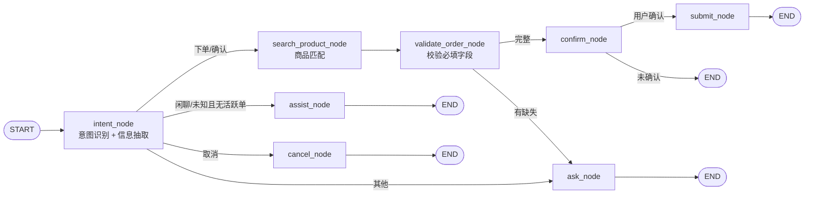

# Hotel AI Order Agent — 功能清单

> 最后更新：2026-06-04  
> 本文档梳理项目**已实现**、**部分实现**与**待实现**功能，便于评审、排期与对外沟通。

---

## 项目定位

酒店场景 **语音/文本 AI 下单 Agent**：把自然语言 → 结构化订单 → 匹配标准商品 → 多轮追问 → 确认 → 提交工单。

**核心技术栈：** Python、FastAPI、LangGraph、LangChain、Qwen Embedding、Chroma、Vue 3

**当前覆盖的业务类型：**

- 单次安装
- 单次测量
- 单次维修服务
- 托管维修

---

## 业务流程概览



---

## 一、已实现功能

### 1.1 核心业务对话流程（LangGraph 状态机）

主流程 8 个节点已全部打通：

| 节点 | 职责 |
| --- | --- |
| `intent_node` | 意图识别 + 订单信息抽取（结构化 JSON） |
| `search_product_node` | 商品向量检索，确定 `service_type` |
| `validate_order_node` | 按服务类型校验必填字段，计算 `missing_info` |
| `ask_node` | 追问缺失信息 / 偏题拉回主线 |
| `assist_node` | 无活跃订单时的闲聊与工具问答 |
| `confirm_node` | 展示预下单信息，等待确认 |
| `cancel_node` | 取消并清空预下单状态 |
| `submit_node` | 提交订单，保存 `last_order` |

**已实现的具体能力：**

| 能力 | 说明 |
| --- | --- |
| 意图识别 | `create_order` / `confirm_order` / `cancel_order` / `smalltalk` / `unknown` |
| 订单信息抽取 | 房号、商品、故障、区域、紧急度、期待开工时间、货物到场、托管范围等 |
| 四种服务类型 | 单次安装、单次测量、单次维修服务、托管维修（必填字段规则不同） |
| 多轮收集 | `order_info` 增量合并，一次只追问一个 `missing_info` 字段 |
| 公区/客房判断 | 关键词 + 房号规则；公区自动 `room_number = /` |
| 期待开工时间 | 支持「明天上午」「3月20日」等自然语言（`graph/expected_time.py`） |
| 确认/取消 | 模板 Prompt + 状态流转（`confirming` → `submitted` / `cancelled`） |
| 偏题处理 | 下单过程中闲聊走 `ask_node`；无活跃单时走 `assist_node` |
| 会话记忆 | LangGraph SQLite checkpoint，同一 `session_id` 多轮恢复 |

**各服务类型必填字段：**

| 订单类型 | 必填字段 | 备注 |
| --- | --- | --- |
| 托管维修（客房） | area、room_number、product、fault | 有房号时 scope 自动为客房 |
| 托管维修（公区） | area、product、fault | 公区关键词时 room_number 自动置 `/` |
| 单次维修服务 | product、fault、expected_start_time | — |
| 单次安装 | product、expected_start_time、goods_arrival_status | 未到场 / 已到场 / 已到物流站 |
| 单次测量 | product、expected_start_time | — |

---

### 1.2 商品匹配（RAG）

| 能力 | 实现位置 |
| --- | --- |
| Excel SPU 加载 | `rag/spu_loader.py` + `assets/spu.xlsx` |
| Qwen embedding 向量化 | `rag/qwen_embedding.py` |
| Chroma 向量库 | `rag/product_store.py`，持久化到 `data/chroma_db/` |
| BM25 + 向量混合检索 | jieba 分词过滤 + 余弦相似度排序 |
| 故障惩罚 | 用户有故障描述时，安装/测量类商品扣 0.15 分 |
| 自动重建索引 | Excel / 模型 / 版本变化时自动重建 |
| service_type 由商品决定 | 匹配结果的 `service_order_type` 写入状态 |
| 统一检索入口 | `tools/product_search.py` → 图节点 + HTTP 接口共用 |

检索流程：

```
query（商品 + 故障）
    ↓
BM25 关键词过滤（剔除无关键词重叠的商品）
    ↓
Chroma 向量排名
    ↓
has_fault 惩罚（安装/测量类扣分）
    ↓
best_match.service_order_type → service_type
```

---

### 1.3 LLM / Prompt / 辅助 Agent

| 能力 | 说明 |
| --- | --- |
| 文件化 Prompt | `prompts/intent/`、`ask/`、`confirm/`、`submit/`、`cancel/`、`assist/` |
| 结构化意图输出 | `intent_node` 使用 `with_structured_output(IntentResult)` |
| 追问生成 | 大部分字段 LLM 生成；时间/货物到场用固定话术 |
| 辅助 Agent | `assist_node` + `create_agent()`，可调用工具 |
| Middleware | 日志、重试、模型/工具调用次数限制（`graph/middleware.py`） |

**辅助 Agent 可用工具：**

| 工具 | 用途 |
| --- | --- |
| `current_time` | 查询当前时间 |
| `search_product_tool` | 商品库检索 |
| `web_search_tool` | Tavily 互联网搜索 |
| `check_package_tool` | 套餐检查 |
| `submit_real_order_tool` | 构造/提交下单参数（辅助 Agent 不直接提交） |

---

### 1.4 后端 API（FastAPI）

| 接口 | 功能 |
| --- | --- |
| `POST /api/chat` | 同步对话 |
| `POST /api/chat/stream` | NDJSON 流式（status / preview / token / final） |
| `GET /api/chat/{session_id}/history` | 历史消息 + `order_preview` |
| `DELETE /api/chat/{session_id}` | 清空会话 checkpoint |
| `GET /api/products` | 商品列表（可按服务类型筛选） |
| `POST /api/products/search` | 商品向量检索调试接口 |
| `GET /health` | 健康检查 |

---

### 1.5 真实下单对接（托管维修）

`tools/order_submit.py` 已实现 **托管维修** 完整链路：

1. 通过 **admin-api** 按商品名查 SPU 详情（含 `faultPhenomenonList`、`areaList`）
2. 组装托管维修下单参数（`POST /app-api/order/company-managed-repair-order/create`）
3. 故障现象匹配、区域匹配、紧急标志、默认联系人/地址等
4. `USER_APP_SUBMIT_ENABLED=true` 且 token 配置完整时 **真正调用线上接口**
5. 未开启时仍生成 `request_payload` 预览，返回 `ORDER-PREVIEW-xxx` 占位单号

**相关配置（`.env`）：**

```env
USER_APP_SUBMIT_ENABLED=false          # 改为 true 才真实提交
USER_APP_ACCESS_TOKEN=...
USER_APP_TENANT_ID=...
ADMIN_API_BASE_URL=...
USER_APP_BASE_URL=...
MANAGED_REPAIR_HOTEL_NAME=...
USER_APP_DEFAULT_CONTACTS=...
USER_APP_DEFAULT_PHONE=...
USER_APP_DEFAULT_ADDRESS=...
# ... 其他默认地址字段
```

---

### 1.6 前端（Vue 3）

| 能力 | 说明 |
| --- | --- |
| 聊天界面 | Markdown 渲染、示例快捷输入 |
| 流式对话 | 默认走 `/api/chat/stream`，打字机效果 |
| 预下单卡片 | 字段完整度、紧急度、匹配商品展示 |
| 浏览器语音输入 | Web Speech API（Chrome 系支持较好） |
| 会话历史 | localStorage + 后端 history 恢复 |
| 商品检索调试页 | `ProductTest.vue`（RAG 参数可调） |

---

### 1.7 工程化与观测

| 能力 | 说明 |
| --- | --- |
| 配置管理 | `.env` + Pydantic Settings |
| LangSmith 追踪 | 可配置 `LANGSMITH_TRACING` |
| LangGraph Studio | `uv run langgraph dev`，图名 `order_graph` |
| 本地 trace 日志 | `trace_event`（`DEBUG_TRACE_ENABLED`） |
| Docker Compose | app + Postgres + Redis + Qdrant |
| 集成测试 | `tests/test_chat_flow.py` 约 13 个真实 LLM 场景 |
| 单元测试 | `tests/test_expected_time.py` |
| 业务用例文档 | `docs/order_test_cases.md` + `tests/fixtures/order_cases.json` |

**运行测试：**

```bash
# 全部集成测试（需配置 LLM Key）
.venv/bin/python -m pytest tests/test_chat_flow.py -v

# 期待开工时间单元测试
.venv/bin/python -m pytest tests/test_expected_time.py -v
```

---

## 二、部分实现 / 半成品

> 有代码或设计，但未形成完整闭环，评审时需单独说明。

| 模块 | 现状 | 缺口 |
| --- | --- | --- |
| **真实下单** | 仅 **托管维修** 有完整 API 对接 | 单次安装 / 单次测量 / 单次维修尚无 create 接口 |
| **下单开关** | 默认 `USER_APP_SUBMIT_ENABLED=false` | 生产需配 token、默认地址、酒店名、区域 ID 等 |
| **商品候选** | 后端有 `product_candidates` 状态字段 | 前端 **不能选 Top-N**，低置信只能继续对话 |
| **订单修改** | Prompt 说「直接说明要改哪里」 | 无独立 `modify_order` 意图/节点，靠 intent 重新抽取 |
| **conversation_summary** | State 有字段，`memory/sqlite_memory.py` 有压缩逻辑 | **主图未接入**，长对话仍靠全量 messages |
| **PostgreSQL 日志** | `save_conversation_log` 可选写入 | 默认 `POSTGRES_ENABLED=false` |
| **Redis 记忆** | `memory/redis_memory.py` 存在 | **主流程未使用**（checkpoint 用 SQLite） |
| **Qdrant** | Docker 已部署 | 商品检索仍用 **本地 Chroma**，Qdrant 未接入 |
| **SQLiteChatMemory** | 独立会话表实现 | 与 LangGraph checkpoint 重复，主流程未用 |
| **流式 token 节点** | `STREAMABLE_TOKEN_NODES` 当前为空 | 部分节点靠 `custom token` 模拟打字机 |
| **README 文档** | 仍引用 `tools/maintenance.py` | 该文件已不存在（逻辑在 `order_submit.py`） |
| **集成测试** | 13 个 pytest 用例 | `order_cases.json` 中 ASR/恶意输入等 **未自动化** |
| **商品召回评测** | 有 notebook / ProductTest 页 | **无离线 golden set 单测** |

---

## 三、待实现功能

### P0 — 上线必备

| 待实现项 | 说明 |
| --- | --- |
| 三种服务类型的真实下单 API | 单次安装、单次测量、单次维修的 create 接口与参数映射 |
| 下单配置与联调闭环 | `.env` 中 token、地址、区域 ID、酒店名等生产配置验证 |
| 商品召回失败策略 | `no_match` 时如何追问、是否转人工、是否展示候选 |
| API 安全 | 鉴权、限流、租户隔离（多酒店） |
| 自动化评测 | `order_cases.json` 挂 pytest；商品召回离线评测集 |

### P1 — 体验与质量

| 待实现项 | 说明 |
| --- | --- |
| 低置信商品让用户点选 | 前端 + 状态机支持选 `product_candidates` |
| ASR 容错 | 文档有 asr_001/002 用例，代码无置信度/二次确认逻辑 |
| 确认/取消短路 | `status=confirming` 时减少重复 intent LLM 调用 |
| 长对话压缩 | 接入 `conversation_summary` 到 intent/ask 节点 |
| 恶意输入防护 | fixtures 有 malicious case，缺代码级 guard |
| CI 友好测试 | mock LLM / record-replay，降低集成测试成本 |

### P2 — 架构扩展

| 待实现项 | 说明 |
| --- | --- |
| Redis / Qdrant 真正接入 | 或删除冗余配置，避免误导 |
| `builder.py` 模块化拆分 | 约 1260 行，维护成本高 |
| Prompt 版本管理与 A/B | 目前只有文件，无版本追踪 |
| 服务端 ASR | 现仅浏览器 Web Speech，酒店嘈杂环境不稳定 |
| 订单状态查询/改单/撤单 | 提交后仅保留 `last_order` 摘要 |
| 人工接管 / HITL | 低置信、复杂场景转人工 |

---

## 四、功能完成度总览

| 领域 | 完成度 | 备注 |
| --- | --- | --- |
| 对话状态机 | ~85% | 主流程完整，修改单/短路可优化 |
| 意图与槽位抽取 | ~75% | 依赖单次 LLM，缺分层评测 |
| 商品 RAG | ~80% | 混合检索可用，缺离线评测与候选 UI |
| 四种类型 **对话收集** | ~85% | 必填规则齐全 |
| 四种类型 **真实下单** | ~25% | 仅托管维修 |
| 前端体验 | ~70% | 流式/语音/卡片有，候选选择无 |
| 测试与评测 | ~40% | 集成测试有，fixtures 未自动化 |
| 生产化 | ~30% | 无鉴权、部分 infra 未接入 |

---

## 五、核心模块索引

| 路径 | 说明 |
| --- | --- |
| `app/main.py` | FastAPI 应用入口 |
| `api/routes.py` | HTTP 路由 |
| `graph/builder.py` | LangGraph 节点、路由、运行入口 |
| `graph/state.py` | AgentState 定义 |
| `graph/expected_time.py` | 期待开工时间解析 |
| `graph/agent.py` | 辅助 Agent（create_agent） |
| `graph/middleware.py` | Agent middleware |
| `prompts/` | 文件化 Prompt |
| `rag/product_store.py` | Chroma 向量库 + BM25 |
| `rag/spu_loader.py` | Excel SPU 加载 |
| `tools/product_search.py` | 商品检索工具 |
| `tools/order_submit.py` | 托管维修真实下单 |
| `tools/registry.py` | 辅助 Agent 工具注册 |
| `frontend/src/App.vue` | 主聊天页面 |
| `frontend/src/views/ProductTest.vue` | 商品检索调试页 |
| `tests/test_chat_flow.py` | 集成测试 |
| `tests/fixtures/order_cases.json` | 业务用例 fixtures |
| `docs/order_test_cases.md` | 业务测试用例说明 |
| `docs/embedding_recall.md` | 商品检索说明 |
| `docs/workflow.md` | LangGraph 流程图 |
| `托管下单接口` | 托管维修 API 示例 |

---

## 六、对外沟通要点

> 与业务方对齐预期时使用。

1. **能对话收集四类订单**（安装、测量、维修、托管维修），字段规则完整。
2. **能真实提交的目前只有托管维修**（且需开启 `USER_APP_SUBMIT_ENABLED` 并配置 token/地址）。
3. 商品匹配决定服务类型，不是 LLM 猜测，降低错单风险。
4. 语音输入依赖浏览器 Web Speech API，暂无服务端 ASR。
5. 低置信商品匹配暂无「让用户点选候选」的 UI，需通过对话澄清。

---

## 相关文档

- [README.md](../README.md) — 项目总览与运行说明
- [docs/workflow.md](./workflow.md) — LangGraph 流程图
- [docs/embedding_recall.md](./embedding_recall.md) — 商品检索原理
- [docs/order_test_cases.md](./order_test_cases.md) — 业务测试用例
- [docs/prompts.md](./prompts.md) — Prompt 目录规范
- [docs/langsmith_tracing.md](./langsmith_tracing.md) — LangSmith 追踪
- [docs/sqlite_memory.md](./sqlite_memory.md) — SQLite checkpoint 说明
