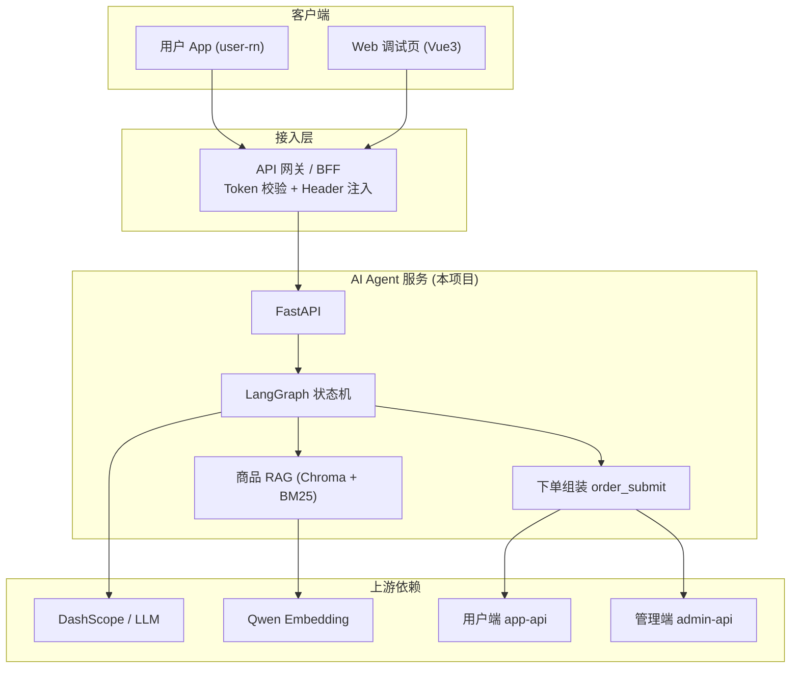
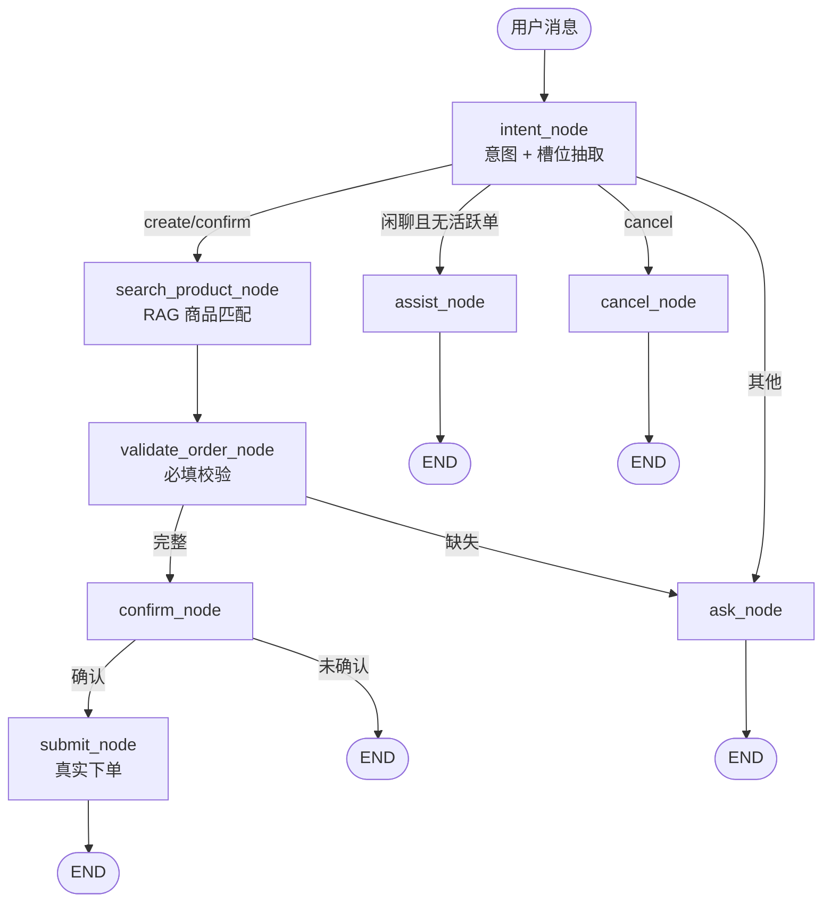
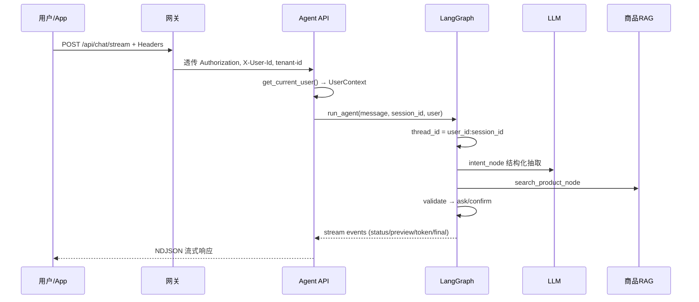
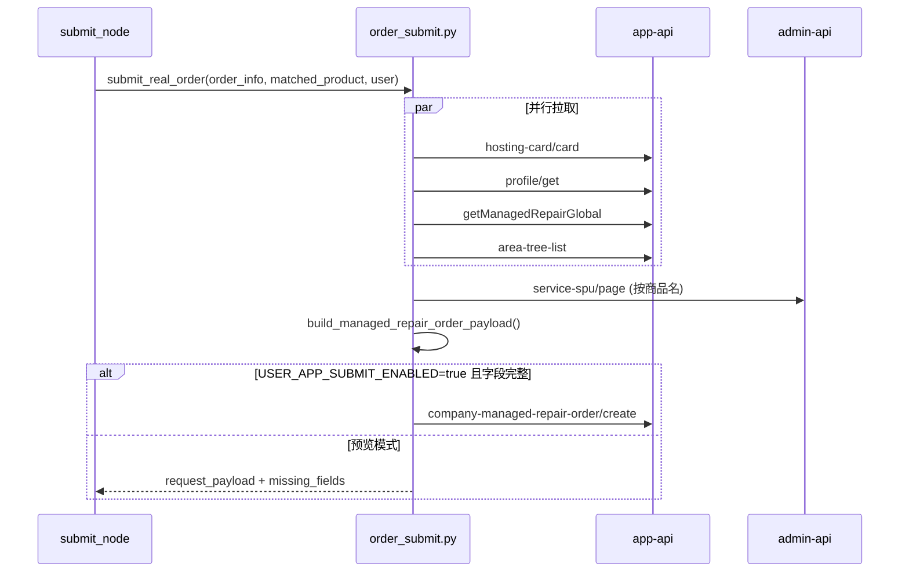

# Hotel AI 语音下单 Agent — 技术架构与开发协作指南

> **文档用途**：技术评审、跨团队会议、开发任务分发与排期对齐  
> **适用对象**：Agent 后端、App（user-rn）、网关/BFF、前端/H5、QA、运维、产品、数据运营  
> **最后更新**：2026-06-06  
> **代码仓库**：`hotel-ai-order-cursor`

---

## 目录

1. [项目背景与目标](#1-项目背景与目标)
2. [系统边界与参与方](#2-系统边界与参与方)
3. [技术架构总览](#3-技术架构总览)
4. [核心功能说明](#4-核心功能说明)
5. [关键数据流](#5-关键数据流)
6. [对外接口与集成规范](#6-对外接口与集成规范)
7. [当前完成度](#7-当前完成度)
8. [开发任务分发（按团队）](#8-开发任务分发按团队)
9. [推荐排期与里程碑](#9-推荐排期与里程碑)
10. [会议讨论议题清单](#10-会议讨论议题清单)
11. [附录：模块索引与相关文档](#11-附录模块索引与相关文档)

---

## 1. 项目背景与目标

### 1.1 业务场景

酒店一线人员（客房、工程、前台等）通过 **语音或文字** 描述维修/安装/测量需求，系统自动完成：

1. 理解意图（下单 / 确认 / 取消 / 闲聊）
2. 抽取结构化订单信息（房号、商品、故障、区域、时间等）
3. 匹配标准商品（SPU），确定服务类型
4. 多轮追问缺失字段
5. 展示预下单信息并等待确认
6. 调用用户端 App 真实下单接口提交工单

### 1.2 覆盖的服务类型

| 服务类型 | 对话收集 | 真实下单 API |
|----------|----------|--------------|
| 托管维修 | ✅ 完整 | ✅ 已对接（`company-managed-repair-order/create`） |
| 单次维修服务 | ✅ 完整 | ❌ 待 App 提供 create 接口 |
| 单次安装 | ✅ 完整 | ❌ 待 App 提供 create 接口 |
| 单次测量 | ✅ 完整 | ❌ 待 App 提供 create 接口 |

### 1.3 非目标（首期不做）

- 替代 App 完整选品 UI（区域树、品类、故障勾选）
- 服务端 ASR 生产方案（当前 Web 演示依赖浏览器语音识别）
- 订单改单/撤单/进度查询的完整闭环（仅保留 `last_order` 摘要）

---

## 2. 系统边界与参与方



### 2.1 职责边界

| 参与方 | 负责什么 | 不负责什么 |
|--------|----------|------------|
| **网关** | Token 校验、注入 `X-User-Id`/`tenant-id`、限流、路由 | 订单业务逻辑、LLM 调用 |
| **App** | 登录态、内嵌对话入口、Header 透传、非托管下单 API 定义 | Agent 对话状态机、商品向量检索 |
| **Agent 后端（本项目）** | 对话、意图抽取、商品匹配、参数组装、调用下单 API | 用户登录、维保卡数据维护 |
| **数据运营** | `spu.xlsx` / 商品主数据更新 | Agent 代码发布 |
| **运维** | 部署、监控、密钥、多实例 | Prompt 调优 |

---

## 3. 技术架构总览

### 3.1 技术栈

| 层级 | 技术选型 |
|------|----------|
| API 层 | Python 3.12、FastAPI、Uvicorn |
| Agent 编排 | LangGraph、LangChain |
| LLM | OpenAI 兼容接口（当前 DashScope Qwen） |
| 会话记忆 | LangGraph SQLite Checkpoint（`thread_id = user_id:session_id`） |
| 商品检索 | Qwen Embedding + Chroma + BM25（jieba） |
| 配置 | Pydantic Settings + `.env` |
| 可观测 | LangSmith（可选）、`trace_event` 本地日志 |
| 前端演示 | Vue 3 + Vite + UnoCSS |
| 依赖管理 | uv |

### 3.2 代码分层

```
app/main.py              # FastAPI 入口
api/
  routes.py              # HTTP 路由
  deps.py                # 用户鉴权（网关 Header）
schemas/
  chat.py                # 对话请求/响应
  user.py                # UserContext、会话 thread_id
graph/
  builder.py             # LangGraph 节点与路由（核心）
  state.py               # AgentState 定义
  llm.py                 # LLM 客户端
  expected_time.py       # 自然语言时间解析
  agent.py               # 辅助 Agent（闲聊/工具）
prompts/                 # 文件化 Prompt（intent/ask/confirm/submit...）
rag/                     # SPU 加载、向量库、Embedding
tools/
  product_search.py      # 商品检索工具
  order_submit.py        # 真实下单组装与提交
frontend/                # Web 调试与演示 UI
tests/                   # 集成测试、fixtures
```

### 3.3 LangGraph 状态机



**设计要点：**

- `service_type` **不由 LLM 直接猜**，由商品匹配结果的 `service_order_type` 决定
- `order_info` 多轮 **增量合并**，`missing_info` 一次只追问一个字段
- 会话隔离：`configurable.thread_id = {user_id}:{session_id}`

---

## 4. 核心功能说明

### 4.1 意图识别与信息抽取（`intent_node`）

LLM 结构化输出，字段包括：

| 字段 | 示例 |
|------|------|
| `room_number` | `0501`、`B栋301` |
| `product` | 电视、空调、水龙头 |
| `fault` | 没信号、漏水、不制冷 |
| `area` / `managed_repair_scope` | 客房、公区 |
| `urgency` | 紧急 / 普通 |
| `expected_start_time` | 明天上午、3月20日 |
| `goods_arrival_status` | 已到场 / 未到场（安装类） |
| `user_confirmed` / `user_cancelled` | 用户确认或取消 |

### 4.2 商品匹配（`search_product_node`）

```
用户描述 (product + fault)
    → BM25 关键词过滤
    → Chroma 向量排序
    → 故障惩罚（有故障时降低安装/测量类得分）
    → products[0].service_order_type → service_type
```

数据源：`assets/spu.xlsx`，索引持久化在 `data/chroma_db/`。

### 4.3 真实下单（`submit_node` → `order_submit.py`）

**当前仅托管维修** 走完整链路。提交时并行拉取 4 个 App 接口：

| 接口 | 作用 |
|------|------|
| `POST /app-api/order/hosting-card/card` | 酒店名、地址、省市区、经纬度、套餐卡 ID（等同 App `selectedAddress`） |
| `POST /app-api/system/profile/get` | 联系人、手机号（等同 App `userStore`） |
| `POST /app-api/system/config/getManagedRepairGlobal` | 响应时间（紧急/普通） |
| `POST /app-api/system/managed-repair-order-homepage/area-tree-list` | 一级区域 ID（客房/公区） |

再查 admin SPU 详情，组装后调用：

`POST /app-api/order/company-managed-repair-order/create`

**参数来源分工：**

| 下单字段 | 来源 |
|----------|------|
| 房号、故障、紧急度 | 对话 `order_info` |
| 酒店地址、省市区、经纬度、hotelName、comboCardId | 维保卡接口 |
| 联系人、电话 | 用户资料接口 > 网关 Header > 维保卡 |
| firstAreaId | area-tree-list 按名称匹配 |
| secondAreaId、故障现象 ID、spuId | admin SPU 详情 |

### 4.4 多用户与鉴权

- 生产：`AUTH_ENABLED=true`，网关验 token 后注入 Header
- 本地/Web 调试：`AUTH_ENABLED=false` 或前端「接口参数」面板手动填 token
- 必填 Header：`Authorization`、`X-User-Id`、`tenant-id`（及 App 约定的 platform/device-id 等）

### 4.5 前端（Web 演示）

| 能力 | 状态 |
|------|------|
| 流式对话 NDJSON | ✅ |
| 预下单卡片 | ✅ 只读展示 |
| 浏览器语音 | ✅ Web Speech API |
| 接口参数可编辑 | ✅ 右侧面板 + localStorage |
| 商品候选点选 | ❌ |
| 确认/取消按钮 | ❌ 仅文字确认 |
| 真实订单号展示 | ⚠️ 弱 |

---

## 5. 关键数据流

### 5.1 一次对话请求



### 5.2 提交订单



---

## 6. 对外接口与集成规范

### 6.1 Agent 对外 API

| 方法 | 路径 | 说明 | 鉴权 |
|------|------|------|------|
| POST | `/api/chat` | 同步对话 | 需要 |
| POST | `/api/chat/stream` | 流式对话（推荐） | 需要 |
| POST | `/api/chat/{session_id}/select-product` | 点选商品卡片 | 需要 |
| GET | `/api/chat/{session_id}/history` | 历史 + order_preview | 需要 |
| DELETE | `/api/chat/{session_id}` | 清空会话 | 需要 |
| GET | `/api/products` | 商品列表（调试） | 无 |
| POST | `/api/products/search` | 商品检索（调试） | 无 |
| GET | `/health` | 健康检查 | 无 |

### 6.2 网关需透传的 Header（与 App 对齐）

| Header | 必填 | 说明 |
|--------|------|------|
| `Authorization` | ✅ | `Bearer {access_token}` |
| `X-User-Id` | ✅ | 网关验签后的用户 ID |
| `tenant-id` | ✅ | 租户/酒店企业 ID |
| `platform` | 建议 | ios / android |
| `type` | 建议 | App 类型，默认 `2` |
| `device-id` | 建议 | 设备 ID |
| `version` / `channel` / `spirit` | 建议 | 与 App 一致 |
| `X-User-Contacts` / `X-User-Phone` | 可选 | 联系人兜底 |

### 6.3 请求体

```json
{
  "session_id": "uuid-xxx",
  "message": "0501房间电视没有信号"
}
```

- `session_id`：客户端维护，同一用户下多轮对话复用
- 不要传 `user_id`（防伪造），由网关 Header 解析

### 6.4 流式响应事件类型

| type | 含义 |
|------|------|
| `session` | 返回 session_id |
| `status` | 节点处理状态 |
| `preview` | 预下单卡片数据 `order_preview` |
| `token` | 打字机文本片段 |
| `final` | 最终回复 + order_preview |
| `error` | 错误信息 |

### 6.5 环境配置要点（Agent 侧）

```env
AUTH_ENABLED=true                    # 生产必开
USER_APP_BASE_URL=...                # 用户端 API
ADMIN_API_BASE_URL=...               # admin SPU 查询
USER_APP_SUBMIT_ENABLED=true         # 是否真实提交订单
OPENAI_BASE_URL=...                  # LLM
QWEN_EMBEDDING_API_KEY=...           # 商品向量
```

酒店/联系人/地址等 **不再依赖 `.env` 写死**，由维保卡与用户资料接口动态获取。

---

## 7. 当前完成度

| 领域 | 完成度 | 上线主要风险 |
|------|--------|--------------|
| 对话状态机 | ~85% | 修改单、确认态优化 |
| 意图与槽位 | ~75% | 缺自动化评测基线 |
| 商品 RAG | ~80% | 缺离线 golden set |
| 四类对话收集 | ~85% | — |
| 四类真实下单 | ~25% | **仅托管维修** |
| 多用户鉴权 | ~60% | 网关正式接入待验证 |
| 前端演示 | ~75% | 非生产 UI |
| 测试评测 | ~40% | fixtures 未全量自动化 |
| 生产运维 | ~30% | 单实例 SQLite、监控不足 |

### 7.1 近期已完成（无需重复立项）

- [x] 多用户：`UserContext` + `user_id:session_id` 会话隔离与越权校验
- [x] 下单酒店信息：维保卡 `hosting-card/card` + `profile/get`（对齐 App）
- [x] 前端默认 token / 接口参数可编辑面板
- [x] LLM/内网 HTTP 绕过 IDE 注入代理（`trust_env=False`）

---

## 8. 开发任务分发（按团队）

> **使用说明**：会议可直接按表格指派 Owner、估时、目标日期。优先级：P0 上线必备 / P1 体验质量 / P2 规模化。

### 8.1 Agent 后端团队（主责：本仓库）

| ID | 任务 | 优先级 | 状态 | 产出物 |
|----|------|--------|------|--------|
| B-01 | 托管维修生产联调（维保卡+SPU+create 全链路） | P0 | 进行中 | 联调报告、错误码清单 |
| B-02 | 单次安装/测量/维修 create 接口接入 | P0 | 待开发 | `order_submit_*.py`、按类型路由 |
| B-03 | 下单失败结构化日志（missing_fields、上游 code） | P0 | 待开发 | 日志字段规范 |
| B-04 | 商品 no_match 策略（话术/转人工/候选） | P0 | 待开发 | 状态机分支 + Prompt |
| B-05 | 健康检查依赖探测（LLM/app-api/admin） | P0 | 待开发 | `/health` 增强 |
| B-06 | 意图/槽位 + 商品召回自动化评测 | P0 | 待开发 | pytest + golden set |
| B-07 | 低置信商品候选选择（后端状态） | P1 | 待开发 | API 支持选中 candidate |
| B-08 | confirming 态短路（少调 intent LLM） | P1 | 待开发 | 路由优化 |
| B-09 | 长对话 summary 接入 | P1 | 待开发 | summary_node 或压缩逻辑 |
| B-10 | 恶意输入 / 提示注入防护 | P1 | 待开发 | guard 中间件 |
| B-11 | `builder.py` 模块化拆分 | P2 | 待开发 | 子包重构 |
| B-12 | 会话存储 Redis 化（多实例） | P2 | 待开发 | checkpoint 迁移方案 |

### 8.2 App 团队（user-rn）

| ID | 任务 | 优先级 | 依赖 | 产出物 |
|----|------|--------|------|--------|
| A-01 | App 内嵌 Agent 对话页（H5 或原生） | P0 | 网关路由 | 入口 PRD + 联调 |
| A-02 | 登录态 Header 透传规范落地 | P0 | 网关 G-01 | Header 文档终版 |
| A-03 | 非托管三类下单 create API 文档与示例 | P0 | 产品定范围 | Swagger/示例 JSON |
| A-04 | 与 Agent 联调：维保卡/区域树/SPU 字段一致性 | P0 | B-01 | 联调 checklist |
| A-05 | 重复下单确认 `confirmDuplicateSubmit` 交互 | P1 | B-01 | 与 App 一致弹窗逻辑 |
| A-06 | 下单结果页展示真实 orderNo | P0 | B-01 | UI 流程 |

### 8.3 网关 / BFF 团队

| ID | 任务 | 优先级 | 产出物 |
|----|------|--------|--------|
| G-01 | Token 校验 + 注入 `X-User-Id`/`tenant-id` | P0 | 网关配置 + 接口说明 |
| G-02 | Agent 服务路由与域名（测试/生产） | P0 | 内网 DNS/ingress |
| G-03 | 限流（按 tenant/user） | P0 | 限流策略 |
| G-04 | 审计日志（session_id、是否下单） | P1 | 日志字段 |
| G-05 | CORS/Header 白名单（若 H5 直连） | P1 | 安全配置 |

### 8.4 前端 / H5 团队（Web 演示 → 可选生产）

| ID | 任务 | 优先级 | 产出物 |
|----|------|--------|--------|
| F-01 | 「确认下单」「取消」明确按钮 | P0 | UI + 固定话术触发 |
| F-02 | 下单结果/失败原因/missing_fields 展示 | P0 | 结果面板 |
| F-03 | 商品候选 Top-N 点选 UI | P1 | 与 B-07 联调 |
| F-04 | 预下单字段手动编辑 | P1 | 表单回传 API（需后端支持） |
| F-05 | 生产环境隐藏调试参数面板 | P1 | 环境开关 |
| F-06 | App WebView 适配（安全区、返回） | P0 | 若走 H5 嵌入 |

### 8.5 语音 / ASR 团队

| ID | 任务 | 优先级 | 产出物 |
|----|------|--------|--------|
| V-01 | 酒店场景 ASR 方案评估（噪声、口音） | P1 | 选型报告 |
| V-02 | 房号/设备热词与二次确认策略 | P1 | 词表 + 交互建议 |
| V-03 | 服务端 ASR → Agent 文本对接 | P1 | 接口协议 |

### 8.6 数据 / 商品运营

| ID | 任务 | 优先级 | 产出物 |
|----|------|--------|--------|
| D-01 | SPU 数据源与更新频率定义 | P0 | 更新 SOP |
| D-02 | `spu.xlsx` 与线上商品一致性校验 | P0 | 对账脚本/周期 |
| D-03 | 商品召回评测集标注（50~100 条） | P0 | golden set 文件 |
| D-04 | 区域名称规范（客房/公区/大堂映射） | P1 | 术语表 |

### 8.7 QA 团队

| ID | 任务 | 优先级 | 产出物 |
|----|------|--------|--------|
| Q-01 | 四类订单 E2E 用例（对话收集） | P0 | 用例表 |
| Q-02 | 托管维修真实下单联调用例 | P0 | 测试报告 |
| Q-03 | 鉴权与 session 越权测试 | P0 | 安全用例 |
| Q-04 | 接口失败降级（无维保卡、无 SPU） | P0 | 异常用例 |
| Q-05 | 性能基线（首 token、整单耗时） | P1 | 压测报告 |

### 8.8 运维 / SRE

| ID | 任务 | 优先级 | 产出物 |
|----|------|--------|--------|
| O-01 | 测试/生产部署（Docker/K8s） | P0 | 部署文档 |
| O-02 | 多实例方案（替代单机 SQLite） | P0 | 架构评审结论 |
| O-03 | 监控告警（错误率、LLM 延迟、下单成功率） | P0 | 看板 + 告警规则 |
| O-04 | 密钥管理（token、API Key 不进仓库） | P0 | 配置中心方案 |
| O-05 | LangSmith / 日志采集 | P1 | 追踪配置 |

### 8.9 产品 / 业务

| ID | 任务 | 优先级 | 产出物 |
|----|------|--------|--------|
| R-01 | 首期上线范围签字（建议：托管维修 + App 内嵌） | P0 | 范围说明 |
| R-02 | 失败转人工规则（匹配失败、下单失败） | P0 | 运营 SOP |
| R-03 | 用户引导话术与示例 | P1 | 文案规范 |
| R-04 | 隐私合规（房号/手机号脱敏留存） | P0 | 合规 checklist |

---

## 9. 推荐排期与里程碑

### 阶段 0：对齐周（第 1 周）

**参会**：产品、App、网关、Agent、QA  

| 交付 | 负责人 |
|------|--------|
| 首期范围确认（托管维修 only？） | 产品 R-01 |
| Header 规范终版 | 网关 G-01 + App A-02 |
| 测试酒店账号 + token + 维保卡 | App + 运维 |
| 非托管 create 接口是否首期 | 产品 + App A-03 |

### 阶段 1：MVP 上线（第 2–5 周）

**目标**：App 内用户完成托管维修语音/文字下单 → 返回真实 `orderNo`（测试环境）

| 周 | 重点 |
|----|------|
| W2 | 网关接入 + Agent 部署测试环境 + App 内嵌骨架 |
| W3 | 维保卡/SPU/create 联调（B-01、A-04） |
| W4 | QA 全量回归（Q-01~Q-04）+ 监控上线（O-03） |
| W5 | 生产灰度 + 试点酒店 |

### 阶段 2：体验与扩展（第 6–10 周）

- 非托管三类真实下单（B-02、A-03）
- 商品候选点选（B-07、F-03）
- ASR 方案试点（V-01~V-03）
- 自动化评测进 CI（B-06、Q-05）

### 阶段 3：规模化（持续）

- 多实例、查单改单、人工接管、Prompt 版本管理

---

## 10. 会议讨论议题清单

建议会议按以下顺序讨论，每项需 **决策人 + 结论**：

### 10.1 范围与优先级

- [ ] 首期是否 **仅托管维修** 真实下单？
- [ ] Web 演示页是否进入生产，还是 **仅 App 内嵌**？
- [ ] 语音首期是否接受浏览器 ASR，还是必须等服务端 ASR？

### 10.2 集成与鉴权

- [ ] `X-User-Id` 由网关 JWT 解析还是 App 直传？
- [ ] Agent 部署在内网还是公网？App 访问路径？
- [ ] `AUTH_ENABLED` 生产默认值与调试环境策略？

### 10.3 接口与数据

- [ ] 非托管三类 `create` 接口何时提供？接口路径与 payload 谁维护？
- [ ] `area-tree-list` 一级区域名称与对话抽取「客房/公区」不一致时谁负责映射？
- [ ] SPU 数据源：继续 `spu.xlsx` 还是接 admin 定时同步？

### 10.4 体验与兜底

- [ ] 商品匹配失败：继续追问 vs 展示候选 vs 转人工？
- [ ] 下单 `missing_fields` 时 Agent 如何引导用户？
- [ ] 重复下单 30 分钟内确认逻辑是否由 App UI 处理？

### 10.5 工程与运维

- [ ] 多实例部署时间表？SQLite checkpoint 迁移 Redis 谁做？
- [ ] LLM/Embedding 成本预算与降级模型策略？
- [ ] 日志脱敏与留存周期？

### 10.6 任务认领

- [ ] 填写「8. 开发任务分发」每张表的 **Owner / 工时 / 截止日期**
- [ ] 明确 **关键路径** 阻塞项（建议：G-01 → A-02 → B-01 → Q-02 → O-01）

---

## 11. 附录：模块索引与相关文档

### 11.1 核心代码路径

| 路径 | 说明 |
|------|------|
| `graph/builder.py` | LangGraph 节点、路由、运行入口 |
| `tools/order_submit.py` | 托管维修下单组装 |
| `api/deps.py` | 网关 Header 鉴权 |
| `schemas/user.py` | UserContext、thread_id |
| `rag/product_store.py` | 商品向量检索 |
| `frontend/src/App.vue` | Web 主界面 |
| `frontend/src/utils/apiParams.ts` | 可调接口参数 |

### 11.2 项目内文档

| 文档 | 内容 |
|------|------|
| [project_status.md](./project_status.md) | 功能清单与完成度（偏产品） |
| [workflow.md](./workflow.md) | LangGraph 流程图 |
| [embedding_recall.md](./embedding_recall.md) | 商品检索原理 |
| [order_test_cases.md](./order_test_cases.md) | 业务测试用例 |
| [sqlite_memory.md](./sqlite_memory.md) | 会话 checkpoint 说明 |
| [prompts.md](./prompts.md) | Prompt 目录规范 |
| [langsmith_tracing.md](./langsmith_tracing.md) | 追踪配置 |

### 11.3 外部参考（App 侧）

| 参考 | 路径（user-rn） |
|------|-----------------|
| 托管维修发布页 | `containers/engineering/CreateHostingOrder/` |
| 维保卡拉取 | `fetchHostingCard` → `/app-api/order/hosting-card/card` |
| 区域树 | `getManagedRepairAreaTreeList` → `area-tree-list` |
| 下单组装 | `buildOrderData()` in store |

### 11.4 本地运行（会议演示用）

```bash
# 后端
uv sync
uv run uvicorn app.main:app --host 0.0.0.0 --port 8000 --reload

# 前端
cd frontend && npm install && npm run dev
# 访问 http://localhost:5173
```

---

## 文档维护

| 版本 | 日期 | 变更 |
|------|------|------|
| v1.0 | 2026-06-06 | 初版：架构、功能、任务分发、会议议题 |

**维护人**：Agent 后端负责人  
**下次评审**：阶段 0 对齐会后更新「任务 Owner」与「排期」列

---

> **会议建议时长**：90 分钟  
> - 0–20min：背景 + 架构讲解（§1–§3）  
> - 20–40min：功能演示 + 数据流（§4–§5，现场跑一条托管维修对话）  
> - 40–60min：集成规范与完成度（§6–§7）  
> - 60–80min：任务认领（§8–§9）  
> - 80–90min：开放议题决策（§10）
