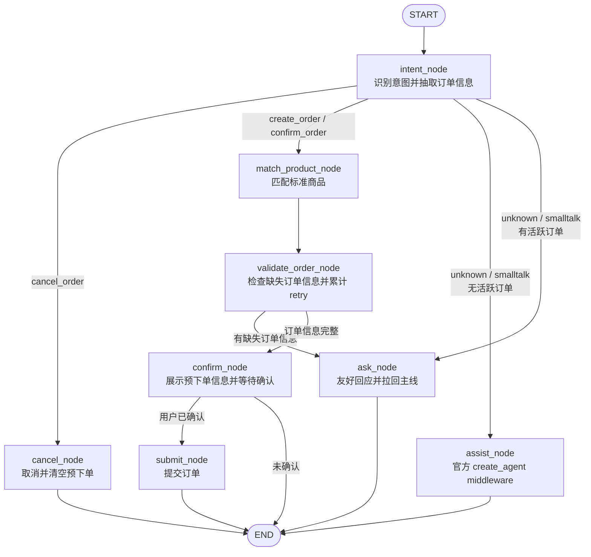

# LangGraph 订单工作流

```mermaid
flowchart TD
    START([START]) --> intent_node[intent_node<br/>识别意图并抽取订单信息]

    intent_node -->|cancel_order| cancel_node[cancel_node<br/>取消并清空预下单]
    intent_node -->|create_order / confirm_order| match_product_node[match_product_node<br/>匹配标准商品]
    intent_node -->|unknown / smalltalk<br/>无活跃订单| assist_node[assist_node<br/>官方 create_agent middleware]
    intent_node -->|unknown / smalltalk<br/>有活跃订单| ask_node[ask_node<br/>友好回应并拉回主线]

    match_product_node --> validate_order_node[validate_order_node<br/>检查缺失订单信息并累计 retry]

    validate_order_node -->|有缺失订单信息| ask_node
    validate_order_node -->|订单信息完整| confirm_node[confirm_node<br/>展示预下单信息并等待确认]

    confirm_node -->|用户已确认| submit_node[submit_node<br/>提交订单]
    confirm_node -->|未确认| END([END])

    ask_node --> END
    assist_node --> END
    cancel_node --> END
    submit_node --> END
```
