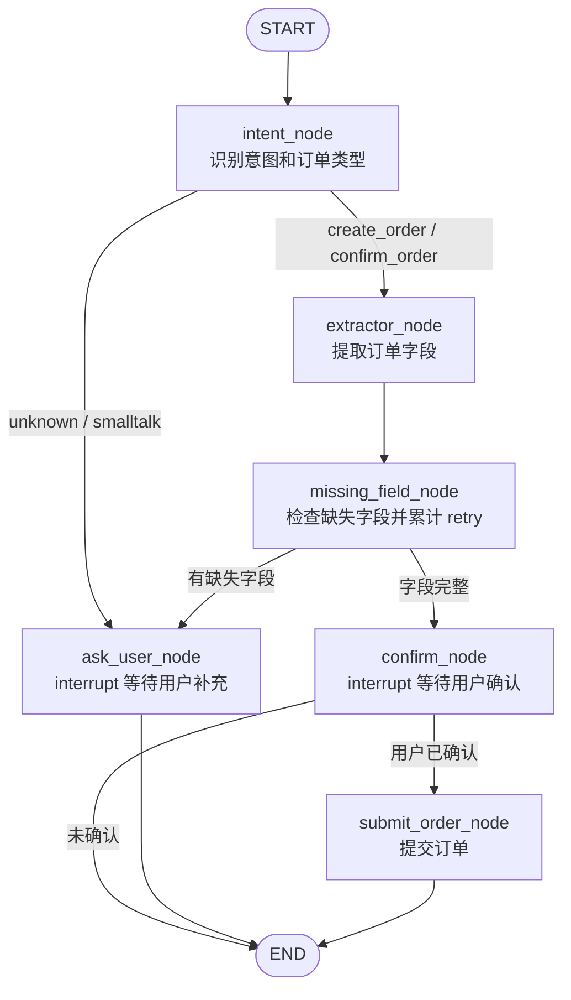

# LangGraph 订单工作流

```mermaid
flowchart TD
    START([START]) --> intent_node[intent_node<br/>识别意图和订单类型]

    intent_node -->|create_order / confirm_order| extractor_node[extractor_node<br/>提取订单字段]
    intent_node -->|unknown / smalltalk| ask_user_node[ask_user_node<br/>interrupt 等待用户补充]

    extractor_node --> missing_field_node[missing_field_node<br/>检查缺失字段并累计 retry]

    missing_field_node -->|有缺失字段| ask_user_node
    missing_field_node -->|字段完整| confirm_node[confirm_node<br/>interrupt 等待用户确认]

    confirm_node -->|用户已确认| submit_order_node[submit_order_node<br/>提交订单]
    confirm_node -->|未确认| END([END])

    ask_user_node --> END
    submit_order_node --> END
```
